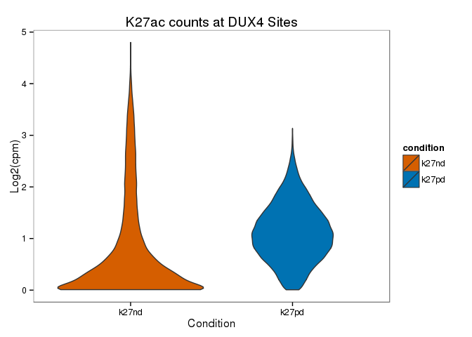
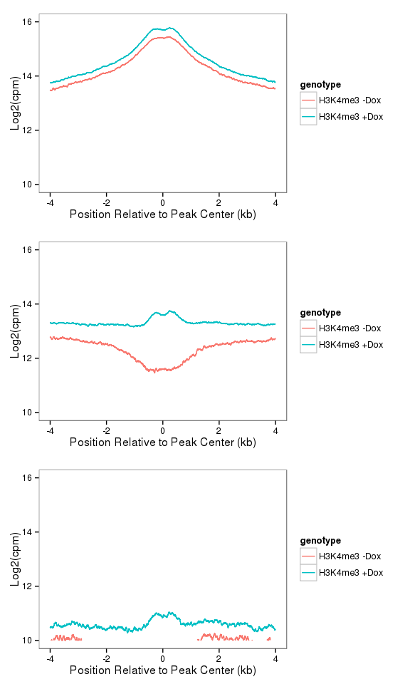
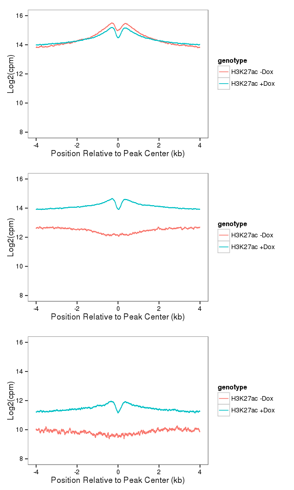
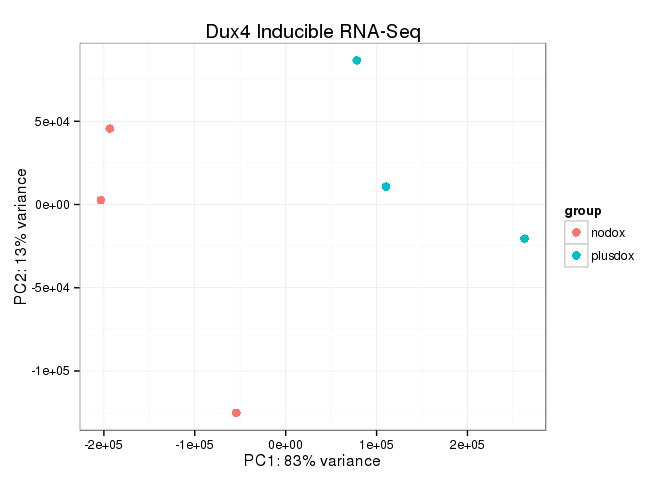
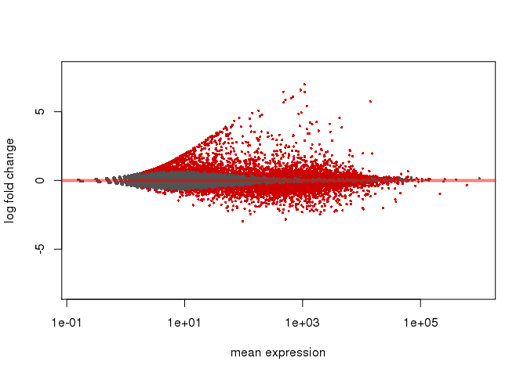

``` r
library("DESeq2")
library("ggplot2")
library("gridExtra")
library("pheatmap")
library("BiocParallel")
library("GenomicAlignments")
library("Rsamtools")
library("rtracklayer")
library("RColorBrewer")
library("dplyr")
library("tidyr")
library(BSgenome.Hsapiens.UCSC.hg19)
hg19<-BSgenome.Hsapiens.UCSC.hg19
library("ChIPpeakAnno")
source("R/hello.R")

ts<-format(Sys.time(), "%a_%b_%d_%Y_%H%M")
cbPalette <- c("#999999", "#E69F00", "#56B4E9", "#009E73", "#F0E442", "#0072B2", "#D55E00", "#CC79A7")
```

Count the Number or Reads in Each ChIP Dataset
==============================================

``` r
h3k27<-new("fileset", filename=c( "../chip/h3k27_nodox.R1_trimmed.fastq.hg19.bam",
                                  "../chip/h3k27_plusdox.R1_trimmed.fastq.hg19.bam"),
           labels=c("H3K27ac -Dox","H3K27ac +Dox"))
(h3k27<-countFileset(h3k27))

DUX4i<-new("fileset",filename=c("../chip/input_plusdox.R1_trimmed.fastq.hg19.bam",
                               "../chip/DUX4.R1_trimmed.fastq.hg19.bam"),
           labels=c("Input +Dox","Flag +Dox"))
(DUX4i<-countFileset(DUX4i))

#pan Histone H3
H3<-new("fileset", filename=c( "../chip/h3_nodox.R1_trimmed.fastq.hg19.bam",
                                  "../chip//h3_plusdox.R1_trimmed.fastq.hg19.bam"),
           labels=c("H3 -Dox","H3 +Dox"))
(H3<-countFileset(H3))

#H3K4me3
h3k4<-new("fileset",filename=c("../chip/h3k4me_s91_nodox.R1_trimmed.fastq.hg19.bam",
           "../chip/h3k4me_s92_plusdox.R1_trimmed.fastq.hg19.bam"),
           labels=c("H3K4me3 -Dox","H3K4me3 +Dox"))
(h3k4<-countFileset(h3k4))

#ENCODE DATA
dnaseFS<-new("fileset",filename=c("../sra/ENCFF001BUR.bam"), labels=c("ENCODE DNAse"))
(dnaseFS<-countFileset(dnaseFS))

save(h3k27,H3,DUX4i,h3k4,dnaseFS,file="filesets.rdata")
```

Import Peaklist To Use
======================

``` r
#hg19blacklist
#downloader::download("http://hgdownload.cse.ucsc.edu/goldenPath/hg19/encodeDCC/wgEncodeMapability/wgEncodeDacMapabilityConsensusExcludable.bed.gz",destfile="hg19_blacklist.bed.gz")
hg19bl<-rtracklayer::import("hg19_blacklist.bed")

dux4_tap<-rtracklayer::import("../sra/dux4_fl_pe5_peaks.bed")
dux4_tap<-keepSeqlevels(dux4_tap,seqlevels(hg19)[1:24])
length(dux4_tap<-dux4_tap[!dux4_tap %over% hg19bl])
```

    ## [1] 134196

``` r
dux4_vs_input<-rtracklayer::import("../chip/DUX4dox_pe5_peaks.bed")
dux4_vs_input_summits<-rtracklayer::import("../chip/DUX4dox_pe5_summits.bed")

#dux4_vs_input<-keepSeqlevels(dux4_vs_input,seqlevels(hg19)[1:24])
#length(dux4_vs_input<-dux4_vs_input[!dux4_vs_input %over% hg19bl])

#Import H327Ac Called Peaks
length(k27pd<-import("../chip/h3k27ac_plusdox_pe5_peaks.bed"))
```

    ## [1] 170981

``` r
length(k27nd<-import("../chip/h3k27ac_nodox_pe5_peaks.bed"))
```

    ## [1] 136827

``` r
#Import DNAse data from ENCODE
#downloader::download("https://www.encodeproject.org/files/ENCFF001BVR/@@download/ENCFF001BVR.bigBed",destfile="ENCFF001BVR.bigBed")
dnase<-read.table("ENCFF001BVR.bed",stringsAsFactors=FALSE)
dnase<-GRanges(seqnames=dnase$V1,IRanges(start=dnase$V2,end=dnase$V3),score=dnase$V7,score2=dnase$V8)

#Download Published Data from http://www.ncbi.nlm.nih.gov/geo/query/acc.cgi?acc=GSE33838
temp<-read.csv("GSM837613_Dux4.full.peak.csv",stringsAsFactors=F)
tsGR<-GRanges(seqnames=temp$chr,IRanges(start=temp$start,end=temp$end),max.cov=temp$max.cov,pval=temp$pval)

hg18ToHg19<-import.chain("hg18ToHg19.over.chain")
length(tsGR_hg19<-unlist(liftOver(tsGR,hg18ToHg19)))
```

    ## [1] 62053

``` r
#export(tsGR_hg19,"tsGR_hg19.bed")
```

Count Reads under DUX4 Peaks in ChIP datasets
=============================================

``` r
dux4dox_1k<-dux4_vs_input_summits+500
dux4dox_4k<-dux4_vs_input_summits+2000

(fls <- list.files("../chip", pattern=glob2rx("*hg19.bam$"),full=TRUE))
bamlst <- BamFileList(fls,yieldSize = 1e5)
detectCores()
BiocParallel::register(MulticoreParam(workers=detectCores()))
system.time(dux4dox_1k_counts <- summarizeOverlaps(dux4dox_1k,bamlst,mode="Union",singleEnd=TRUE,ignore.strand=TRUE))
system.time(dux4dox_4k_counts <- summarizeOverlaps(dux4dox_4k,bamlst,mode="Union",singleEnd=TRUE,ignore.strand=TRUE))

apply(assays(dux4dox_1k_counts)$counts,2,sum)
apply(assays(dux4dox_4k_counts)$counts,2,sum)
save(dux4dox_1k_counts,dux4dox_4k_counts,file="DUX4_counts.rdata")
```

Evaluate Counts under DUX4 Peaks
================================

``` r
load("filesets.rdata")
load("DUX4_counts.rdata")

head(assays(dux4dox_1k_counts)$counts)
```

    ##      DUX4.R1_trimmed.fastq.hg19.bam h3k27_nodox.R1_trimmed.fastq.hg19.bam
    ## [1,]                             62                                     0
    ## [2,]                            107                                     2
    ## [3,]                             97                                    29
    ## [4,]                             82                                    13
    ## [5,]                             61                                     1
    ## [6,]                             59                                   112
    ##      h3k27_plusdox.R1_trimmed.fastq.hg19.bam
    ## [1,]                                      21
    ## [2,]                                      20
    ## [3,]                                      34
    ## [4,]                                      36
    ## [5,]                                      11
    ## [6,]                                      47
    ##      h3_nodox.R1_trimmed.fastq.hg19.bam
    ## [1,]                                154
    ## [2,]                                137
    ## [3,]                                131
    ## [4,]                                123
    ## [5,]                                157
    ## [6,]                                 79
    ##      h3_plusdox.R1_trimmed.fastq.hg19.bam
    ## [1,]                                  166
    ## [2,]                                  112
    ## [3,]                                  125
    ## [4,]                                  114
    ## [5,]                                  159
    ## [6,]                                   86
    ##      input_nodox.R1_trimmed.fastq.hg19.bam
    ## [1,]                                    10
    ## [2,]                                    24
    ## [3,]                                    10
    ## [4,]                                    10
    ## [5,]                                    13
    ## [6,]                                    19
    ##      input_plusdox.R1_trimmed.fastq.hg19.bam
    ## [1,]                                      14
    ## [2,]                                      25
    ## [3,]                                      16
    ## [4,]                                       5
    ## [5,]                                      12
    ## [6,]                                      10

``` r
gr<-rowRanges(dux4dox_1k_counts)
head(gr)
```

    ## GRanges object with 6 ranges and 2 metadata columns:
    ##       seqnames             ranges strand |        name     score
    ##          <Rle>          <IRanges>  <Rle> | <character> <numeric>
    ##   [1]     chr1 [  42229,   43229]      * | MACS_peak_1        11
    ##   [2]     chr1 [  43513,   44513]      * | MACS_peak_2        19
    ##   [3]     chr1 [ 668733,  669733]      * | MACS_peak_3        28
    ##   [4]     chr1 [ 672134,  673134]      * | MACS_peak_4        28
    ##   [5]     chr1 [ 830556,  831556]      * | MACS_peak_5        11
    ##   [6]     chr1 [1310241, 1311241]      * | MACS_peak_6        16
    ##   -------
    ##   seqinfo: 40 sequences from an unspecified genome; no seqlengths

``` r
#idx<-!keepSeqlevels(gr,seqlevels(hg19)[1:24]) %over% hg19bl
#allcounts<-assays(dux4dox_1k_counts)$counts[idx,]
allcounts<-assays(dux4dox_1k_counts)$counts[,]
#(n<-colSums(allcounts))
#length(gr<-gr[idx])
gr$k27nd<-log2(allcounts[,2]*1e6/h3k27@count[1] + 1)
gr$k27pd<-log2(allcounts[,3]*1e6/h3k27@count[2] + 1)
gr$input<-log2(allcounts[,7]*1e6/DUX4i@count[1] + 1)
gr$dux4<-log2(allcounts[,1]*1e6/DUX4i@count[2] + 1)

#Filter ranges on short Contigs
length(gr<-keepSeqlevels(gr,seqlevels(hg19)[1:24]))
```

    ## [1] 31570

``` r
#Filter ranges that overlap BlackListed Peaks
length(gr<-gr[!gr %over% hg19bl])
```

    ## [1] 31545

``` r
#Filter ranges with 'outlier' input counts
(cutoff <-quantile(as.numeric(gr$input), 3/4)+1.5*IQR(as.numeric(gr$input)))
```

    ##       75% 
    ## 0.8244891

``` r
length(gr<-gr[gr$input < cutoff])
```

    ## [1] 31026

``` r
(gg_violin<- as.data.frame(mcols(gr)[,3:4]) %>%
  gather(condition,log2cpm) %>%
#  dplyr::filter(log2cpm > 0) %>%
  ggplot(aes(x=condition,y=log2cpm)) + ggtitle("K27ac counts at DUX4 Sites") +
   xlab("Condition") + ylab("Log2(cpm)") +
   geom_violin(aes(fill=condition)) +
  scale_fill_manual(values=cbPalette[c(7,6)]) +
   theme_bw() + theme(panel.grid.major=element_blank(),
                     panel.grid.minor=element_blank())
)
```



``` r
#ggsave(file="011916_violin.svg",device = svglite::svglite,plot=gg_violin,width=8.5,height=6)
save(gg_violin,file=paste0(ts,"_figure5b.rdata"))

#Order by DUX4 peak score
gr<-gr[with(gr,order(-score))]

#Add a logical to indicated DNAse Overlap
gr$dnase_overlap <- gr %over% dnase

#Replace dux4dox_1k with "cleaned up" version
length(dux4dox_1k <- gr)
```

    ## [1] 31026

``` r
length(dux4dox_1k_dnase <- gr[gr$dnase_overlap])
```

    ## [1] 12919

``` r
length(dux4dox_1k_nodnase <- gr[!gr$dnase_overlap])
```

    ## [1] 18107

``` r
#Also Filter full Length DUX4 Peaks
length(dux4_vs_input<-dux4_vs_input[dux4_vs_input$name %in% dux4dox_1k$name])
```

    ## [1] 31026

``` r
seqlevels(dux4_vs_input) <- seqlevels(dux4dox_1k)
length(dux4_vs_input) == length(dux4dox_1k)
```

    ## [1] TRUE

Measure Overlap with Geng et al 2012 Data
=========================================

``` r
#Overlap with Published Peak List
mean(dux4_vs_input  %over% tsGR_hg19)
```

    ## [1] 0.1068136

``` r
#Overlap with  MACS calls of Geng et al  DUX4 ChIP data
mean(dux4_vs_input %over% dux4_tap)
```

    ## [1] 0.1750467

Figure 5c
=========

``` r
benchplot(dux4_total<-twister(dux4dox_1k,dataset=DUX4i,pad = 3500,ord=0,window=1,ya=c(12,16)))
benchplot(h3k27ac_total<-twister(dux4dox_1k,dataset=h3k27,pad = 3500,ord=0,window=1,ya=c(12,16)))
grid.arrange(dux4_total,h3k27ac_total,ncol=1)
save(dux4_total,h3k27ac_total,file=paste0(ts,"_figure5c.rdata"))
```

``` r
#mySession = browserSession("UCSC")
#genome(mySession) <- "hg19"
#tbl.rmsk <- getTable(ucscTableQuery(mySession, track="rmsk",table="rmsk"))
#save(tbl.rmsk,file="rmsk_full_hg19.rdata")
load("rmsk_full_hg19.rdata")
class(tbl.rmsk)
```

    ## [1] "data.frame"

``` r
 #tbl.rmsk<-tbl.rmsk[tbl.rmsk$repFamily=="ERVL-MaLR",]
 maLR<-GRanges(seqnames=tbl.rmsk$genoName,ranges=IRanges(start=tbl.rmsk$genoStart,end=tbl.rmsk$genoEnd),strand=tbl.rmsk$strand,name=tbl.rmsk$repName)
 maLR<-keepSeqlevels(maLR,seqnames(hg19)[1:24])
 maLR <- sortSeqlevels(maLR)
 maLR<-sort(maLR,ignore.strand=TRUE)
 #export(maLR,"malR_hg19.bed")

length(dux4dox_1k_nodnase_maLR <- dux4dox_1k_nodnase[dux4dox_1k_nodnase %over% maLR])
```

    ## [1] 15786

``` r
length(dux4dox_1k_nodnase_nomaLR <- dux4dox_1k_nodnase[!dux4dox_1k_nodnase %over% maLR])
```

    ## [1] 2321

MaLR H3K4me3
============

``` r
h3k4me3_dnase <-twister(dux4dox_1k_dnase,dataset=h3k4,pad = 3500,ord=0,window=1,color="blue",ya=c(10,16))
h3k4me3_nodnase_maLR<-twister(dux4dox_1k_nodnase_maLR,dataset=h3k4,pad = 3500,ord=0,window=1,color="blue",ya=c(10,16))
h3k4me3_nodnase_nomaLR<-twister(dux4dox_1k_nodnase_nomaLR,dataset=h3k4,pad = 3500,ord=0,window=1,color="blue",ya=c(10,16))
save(h3k4me3_dnase,h3k4me3_nodnase_maLR,h3k4me3_nodnase_nomaLR,file=paste0(ts,"_figure5d_h3k4_malr.rdata"))
grid.arrange(h3k4me3_dnase,h3k4me3_nodnase_maLR,h3k4me3_nodnase_nomaLR,ncol=1)
```

    ## Warning: Removed 93 rows containing missing values (geom_path).



MaLR H3K7Ac
===========

``` r
h3k27_dnase <-twister(dux4dox_1k_dnase,dataset=h3k27,pad = 3500,ord=0,window=1,color="blue",ya=c(8,16))
h3k27_nodnase_maLR<-twister(dux4dox_1k_nodnase_maLR,dataset=h3k27,pad = 3500,ord=0,window=1,color="blue",ya=c(8,16))
h3k27_nodnase_nomaLR<-twister(dux4dox_1k_nodnase_nomaLR,dataset=h3k27,pad = 3500,ord=0,window=1,color="blue",ya=c(8,16))
save(h3k27_dnase,h3k27_nodnase_maLR,h3k27_nodnase_nomaLR,file=paste0(ts,"_figure5d_h3k27_malr.rdata"))
grid.arrange(h3k27_dnase,h3k27_nodnase_maLR,h3k27_nodnase_nomaLR,ncol=1)
```



### Analyze K27ac at non-DUX4 Sites

``` r
length(k27pdr<-reduce(k27pd,min.gapwidth=1000))
length(k27ndr<-reduce(k27nd,min.gapwidth=1000))
length(k27r<-reduce(c(k27pdr,k27ndr),min.gapwidth=1))
k27r<-keepSeqlevels(k27r,seqlevels(hg19)[1:24])
mean(idx<-!k27r %over% hg19bl)
k27r<-k27r[idx]
summary(width(k27r))
summary(width(center(k27r)+1000))
k27rc_2k<-center(k27r)+1000

length(dux4_vs_input)
length(k27rc_2k_noDux<-k27rc_2k[!(k27rc_2k+10000) %over% dux4_vs_input])
(fls <- list.files("../chip", pattern=glob2rx("h3k27*hg19.bam$"),full=TRUE))
bamlst <- BamFileList(fls,yieldSize = 1e5)
detectCores()
BiocParallel::register(MulticoreParam(workers=detectCores()))
system.time(h3k27_counts <- summarizeOverlaps(k27rc_2k_noDux,bamlst,mode="Union",singleEnd=TRUE,ignore.strand=TRUE))

n<-apply(assays(h3k27_counts)$counts,2,sum)
x<-1e6*assays(h3k27_counts)$counts
x[,1]<-x[,1]/h3k27@count[1]
x[,2]<-x[,2]/h3k27@count[2]

x<-log2(x+1)

gg_violin2<-as.data.frame(x) %>% 
  gather(condition,log2cpm) %>% 
  #dplyr::filter(log2cpm > 0) %>%
  ggplot(aes(x=condition,y=log2cpm)) + ggtitle("K27ac counts at Non-DUX4 Sites") +
   xlab("Condition") + ylab("Log2(cpm)") + 
   geom_violin(aes(fill=condition)) + 
  scale_fill_manual(values=cbPalette[c(7,6)]) +
   theme_bw() + theme(panel.grid.major=element_blank(),
                     panel.grid.minor=element_blank())

save(gg_violin2,file="011416_k27rc_2k_noDux_violin.rdata")


#now make Tornado Plots
temp<-k27rc_2k_noDux
temp$ratio<-x[,2]-x[,1]
temp<-temp[with(temp,order(-ratio))]
#benchplot(k27r_k27_dnase<-tornado(temp,dataset=h3k27,pad = 4500,ord=0,window=5,color="darkgreen"))
#benchplot(k27r_DUX4i_dnase<-tornado(temp,dataset=DUX4i,pad = 4500,ord=0,window=5,color="blue"))

#ggsave(file="011416_k27r_k27_Tornado_dnase.png",plot=k27r_k27_dnase,width=5,height=8)
#ggsave(file="011416_k27r_DUX4i_Tornado_dnase.png",plot=k27r_DUX4i_dnase,width=5,height=8)
```

### RNA-Seq Analysis

``` r
#Use most recent hg19 build
ensembl_75 = useMart(host = "feb2014.archive.ensembl.org", biomart = "ENSEMBL_MART_ENSEMBL", 
    dataset = "hsapiens_gene_ensembl")        
        
txdb<-makeTxDbFromBiomart(biomart="ENSEMBL_MART_ENSEMBL",host = "feb2014.archive.ensembl.org",dataset="hsapiens_gene_ensembl")
ens75<-exonsBy(txdb,by="gene")
save(ens75,file="ens75.rdata")

(fls <- list.files(".", pattern="GRCh37.q4.bam$",full=TRUE))
register(MulticoreParam(workers=12))
load("ens75.rdata")
bamlst <- BamFileList(fls)
hits_q4 <- summarizeOverlaps(ens75,bamlst,mode="Union",singleEnd=FALSE,ignore.strand=TRUE)
apply(assays(hits_q4)$counts,2,sum)

(fls <- list.files(".", pattern="GRCh37.bam$",full=TRUE))
bamlst <- BamFileList(fls)
hits <- summarizeOverlaps(ens75,bamlst,mode="Union",singleEnd=FALSE,ignore.strand=TRUE)
apply(assays(hits)$counts,2,sum)
save(hits_q4,hits,file="GRCh37_hits.rdata")
```

``` r
load("../rna/GRCh37_hits.rdata")
load("hgnc.rdata")

cds<-DESeqDataSet(hits_q4,design=~1)
colnames(cds)<-sapply(strsplit(colnames(cds),"_"),function(x) x[1])
cds$dox<-as.factor(rep(c("nodox","plusdox"),each=3))
design(cds)<-(~dox)

plotPCA( DESeqTransform( cds ) ,intgroup = c("dox"))+
  ggtitle("Dux4 Inducible RNA-Seq") + theme_bw()
```



``` r
cds<-DESeq(cds)
```

    ## estimating size factors
    ## estimating dispersions
    ## gene-wise dispersion estimates
    ## mean-dispersion relationship
    ## final dispersion estimates
    ## fitting model and testing

``` r
plotMA(cds,ylim=c(-8,8))
```



``` r
#results
res<-results(cds)
res<-as.data.frame(res)

#get annotations
#ensembl_83 = useMart(biomart="ENSEMBL_MART_ENSEMBL", host="www.ensembl.org", path="/biomart/martservice",dataset="hsapiens_gene_ensembl")
#hgnc<-getBM(filters="ensembl_gene_id",values=rownames(res),
#      attributes=c("ensembl_gene_id","hgnc_symbol"),mart=ensembl_83)
#save(hgnc,file="hgnc.rdata")
idx<-match(rownames(res),hgnc$ensembl_gene_id)
res$hgnc<-hgnc[idx,"hgnc_symbol"]
res<-res[!is.na(res$padj),]
res<-res[with(res,order(padj,-log2FoldChange)),]
res[grep("ZSCAN4",res$hgnc),]
```

    ##                 baseMean log2FoldChange     lfcSE     stat pvalue padj
    ## ENSG00000180532 14101.19       5.727479 0.1434848 39.91697      0    0
    ##                   hgnc
    ## ENSG00000180532 ZSCAN4

``` r
#plot(res$log2FoldChange,-1*log10(res$padj),cex=0.5,pch=16)


#11-17-15
f<-as.data.frame(fpkm(cds))
idx<-match(rownames(f),hgnc$ensembl_gene_id)
f$hgnc<-hgnc[idx,2]
head(f)
```

    ##                 LHCNM2iDUX4HTFCtrl1 LHCNM2iDUX4HTFCtrl2
    ## ENSG00000000003            6.854749          6.39278449
    ## ENSG00000000005            0.000000          0.00000000
    ## ENSG00000000419           37.752066         36.37772977
    ## ENSG00000000457            1.079787          0.94388599
    ## ENSG00000000460            3.568490          3.68965182
    ## ENSG00000000938            0.000000          0.02859504
    ##                 LHCNM2iDUX4HTFCtrl3 LHCNM2iDUX4HTFDox1 LHCNM2iDUX4HTFDox2
    ## ENSG00000000003            7.080320           7.088413         7.45516837
    ## ENSG00000000005            0.000000           0.000000         0.00000000
    ## ENSG00000000419           36.583945          40.944085        37.32635279
    ## ENSG00000000457            1.039686           1.318591         1.39446488
    ## ENSG00000000460            3.616018           3.712998         3.57909615
    ## ENSG00000000938            0.000000           0.000000         0.02653874
    ##                 LHCNM2iDUX4HTFDox3     hgnc
    ## ENSG00000000003           7.843839   TSPAN6
    ## ENSG00000000005           0.000000     TNMD
    ## ENSG00000000419          40.718931     DPM1
    ## ENSG00000000457           1.294814    SCYL3
    ## ENSG00000000460           3.351488 C1orf112
    ## ENSG00000000938           0.000000      FGR

``` r
f[grep("ZSCAN4",f$hgnc),]
```

    ##                 LHCNM2iDUX4HTFCtrl1 LHCNM2iDUX4HTFCtrl2
    ## ENSG00000180532            5.379873            6.663893
    ##                 LHCNM2iDUX4HTFCtrl3 LHCNM2iDUX4HTFDox1 LHCNM2iDUX4HTFDox2
    ## ENSG00000180532            6.528728           433.8269           440.2072
    ##                 LHCNM2iDUX4HTFDox3   hgnc
    ## ENSG00000180532           335.6007 ZSCAN4

``` r
f[grep("MYOD1",f$hgnc),]
```

    ##                 LHCNM2iDUX4HTFCtrl1 LHCNM2iDUX4HTFCtrl2
    ## ENSG00000129152            47.69161            49.51331
    ##                 LHCNM2iDUX4HTFCtrl3 LHCNM2iDUX4HTFDox1 LHCNM2iDUX4HTFDox2
    ## ENSG00000129152            51.12213           4.697423           4.624283
    ##                 LHCNM2iDUX4HTFDox3  hgnc
    ## ENSG00000129152            9.93699 MYOD1

``` r
write.csv(f,file="Supplementary_Table_1.csv",quote=F)
```

``` r
#tss<-getAnnotation(ensembl_75,featureType="TSS",output="GRanges")
load("tss.rdata")
length(dux4_vs_input)
```

    ## [1] 31026

``` r
dux4_vs_input_anno <- annotatePeakInBatch(dux4_vs_input, AnnotationData=tss, output="nearest", maxgap=100L)
summary(dux4_vs_input_anno$shortestDistance)
```

    ##    Min. 1st Qu.  Median    Mean 3rd Qu.    Max. 
    ##       0    8045   24010   45070   57840  669300

``` r
#res$peak10kb<-rownames(res) %in% unique(dux4_vs_flag_anno$feature)
res$peak10kb<-"> 50kb"
overs<-unique(dux4_vs_input_anno[dux4_vs_input_anno$insideFeature=="overlapStart",]$feature)
fivekb<-unique(dux4_vs_input_anno[dux4_vs_input_anno$shortestDistance < 5000,]$feature)
fivekb<-fivekb[!fivekb %in% overs]
tenkb<-unique(dux4_vs_input_anno[dux4_vs_input_anno$shortestDistance < 10000,]$feature)
tenkb<-tenkb[!(tenkb %in% fivekb) & !(tenkb %in% overs)]
fiftykb<-unique(dux4_vs_input_anno[dux4_vs_input_anno$shortestDistance < 50000,]$feature)
fiftykb<-tenkb[!(fiftykb %in% tenkb) & !(fiftykb %in% fivekb) & !(fiftykb %in% overs)]
res[rownames(res) %in% overs,"peak10kb"]<-"Overlap's Start"
res[rownames(res) %in% fivekb,"peak10kb"]<-"< 5Kb"
res[rownames(res) %in% tenkb,"peak10kb"]<-"< 10Kb"
res[rownames(res) %in% fiftykb,"peak10kb"]<-"< 50Kb"
table(res$peak10kb)
```

    ## 
    ##          < 10Kb          > 50kb          < 50Kb           < 5Kb 
    ##             421           16034             276            1638 
    ## Overlap's Start 
    ##             288

``` r
gg1<-res %>% 
  mutate(mlogp=-1*log10(padj)) %>% 
  mutate(peak10kb=factor(peak10kb,levels=c("Overlap's Start","< 5Kb","< 10Kb","< 50Kb","> 50kb"))) %>% 
  ggplot(aes(x=log2FoldChange,y=mlogp,color=peak10kb)) +
  geom_point(size=3) + scale_color_manual(values=cbPalette[c(2,6,7,8,1)],
                                    name="Distance to Dux4 Peak") +
  xlab("DUX4 Induced Log2 Fold Change")+
  ggtitle("All Genes")+
  ylab("-log10(Adjusted P Value)") +
  xlim(c(-3,7)) + ylim(c(0,260)) + 
  theme_bw() + theme(panel.grid.major=element_blank(),
                     panel.grid.minor=element_blank())

#separate based on DNASE overlap
#FirstlLoad DNAse data
dnase<-read.table("ENCFF001BVR.bed",stringsAsFactors=FALSE)
dnase<-GRanges(seqnames=dnase$V1,IRanges(start=dnase$V2,end=dnase$V3),score=dnase$V7,score2=dnase$V8)

dux4_vs_input_anno$dnase <- dux4_vs_input_anno %over% dnase
overs_dnase<-unique(dux4_vs_input_anno[dux4_vs_input_anno$insideFeature=="overlapStart" & dux4_vs_input_anno$dnase,]$feature)
overs_nodnase<-unique(dux4_vs_input_anno[dux4_vs_input_anno$insideFeature=="overlapStart" & !dux4_vs_input_anno$dnase,]$feature)

fivekb_dnase<-unique(dux4_vs_input_anno[dux4_vs_input_anno$shortestDistance < 5000 & dux4_vs_input_anno$dnase,]$feature)
fivekb_nodnase<-unique(dux4_vs_input_anno[dux4_vs_input_anno$shortestDistance < 5000 & !dux4_vs_input_anno$dnase,]$feature)
fivekb_dnase<-fivekb_dnase[!fivekb_dnase %in% overs]
fivekb_nodnase<-fivekb_nodnase[!fivekb_nodnase %in% overs]

tenkb_dnase<-unique(dux4_vs_input_anno[dux4_vs_input_anno$shortestDistance < 10000 & dux4_vs_input_anno$dnase,]$feature)
tenkb_nodnase<-unique(dux4_vs_input_anno[dux4_vs_input_anno$shortestDistance < 10000 & !dux4_vs_input_anno$dnase,]$feature)
tenkb_dnase<-tenkb_dnase[!(tenkb_dnase %in% fivekb) & !(tenkb_dnase %in% overs)]
tenkb_nodnase<-tenkb_nodnase[!(tenkb_nodnase %in% fivekb) & !(tenkb_nodnase %in% overs)]

fiftykb_dnase<-unique(dux4_vs_input_anno[dux4_vs_input_anno$shortestDistance < 50000 & dux4_vs_input_anno$dnase,]$feature)
fiftykb_nodnase<-unique(dux4_vs_input_anno[dux4_vs_input_anno$shortestDistance < 50000 & !dux4_vs_input_anno$dnase,]$feature)
fiftykb_dnase<-tenkb[!(fiftykb_dnase %in% tenkb) & !(fiftykb_dnase %in% fivekb) & !(fiftykb_dnase %in% overs)]
fiftykb_nodnase<-tenkb[!(fiftykb_nodnase %in% tenkb) & !(fiftykb_nodnase %in% fivekb) & !(fiftykb_nodnase %in% overs)]

res$dnase<-NA
res[rownames(res) %in% overs_dnase,"dnase"]<-TRUE
res[rownames(res) %in% fivekb_dnase,"dnase"]<-TRUE
res[rownames(res) %in% tenkb_dnase,"dnase"]<-TRUE
res[rownames(res) %in% fiftykb_dnase,"dnase"]<-TRUE
res[rownames(res) %in% overs_nodnase,"dnase"]<-FALSE
res[rownames(res) %in% fivekb_nodnase,"dnase"]<-FALSE
res[rownames(res) %in% tenkb_nodnase,"dnase"]<-FALSE
res[rownames(res) %in% fiftykb_nodnase,"dnase"]<-FALSE


gg2<-res %>% 
  dplyr::filter(peak10kb != "> 50kb" & dnase) %>% 
  mutate(mlogp=-1*log10(padj)) %>% 
  mutate(peak10kb=factor(peak10kb,levels=c("Overlap's Start","< 5Kb","< 10Kb","< 50Kb","> 50kb"))) %>% 
  ggplot(aes(x=log2FoldChange,y=mlogp,color=peak10kb)) +
  geom_point(size=3) + scale_color_manual(values=cbPalette[c(2,6,7,8,1)],
                                    name="Distance to Dux4 Peak") +
  xlab("DUX4 Induced Log2 Fold Change")+
  ggtitle("DNAse Accesible") +
  ylab("-log10(Adjusted P Value)") +
  xlim(c(-3,7)) + ylim(c(0,260)) + 
  theme_bw() + theme(panel.grid.major=element_blank(),
                     panel.grid.minor=element_blank())

gg3<-res %>% 
  dplyr::filter(peak10kb != "> 50kb" & !dnase) %>% 
  mutate(mlogp=-1*log10(padj)) %>% 
  mutate(peak10kb=factor(peak10kb,levels=c("Overlap's Start","< 5Kb","< 10Kb","< 50Kb","> 50kb"))) %>% 
  ggplot(aes(x=log2FoldChange,y=mlogp,color=peak10kb)) +
  geom_point(size=3) + scale_color_manual(values=cbPalette[c(2,6,7,8,1)],
                                    name="Distance to Dux4 Peak") +
  xlab("DUX4 Induced Log2 Fold Change")+
  ggtitle("DNAse In-accesible") +
  ylab("-log10(Adjusted P Value)") +
  xlim(c(-3,7)) + ylim(c(0,260)) + 
  theme_bw() + theme(panel.grid.major=element_blank(),
                     panel.grid.minor=element_blank())

save(gg1,gg2,gg3,file=paste0(ts,"_figure6c.rdata"))

#no Cairo on mesabi
#ggsave(file="010816_volcano1.svg",device = svglite::svglite,plot=gg1,width=8.5,height=6)
#ggsave(file="010816_volcano2.svg",device = svglite::svglite,plot=gg2,width=8.5,height=6)
#ggsave(file="010816_volcano3.svg",device = svglite::svglite,plot=gg3,width=8.5,height=6)

#plot(res$log2FoldChange,-1*log10(res$padj),cex=0.5,pch=16,
#     xlab="Dux4 induction Log2Fold Change",ylab="-log10(adjusted p-value)")
#identify(res$log2FoldChange,-1*log10(res$padj),labels=res$hgnc)
```

Use the rlog to find some high variance genes that aren't likely due to noise.
==============================================================================

``` r
rld <- rlog(cds, blind=FALSE)
hist(res$pvalue[res$baseMean > 1], breaks=0:20/20, col="grey50", border="white")

topVarGenes <- head(order(rowVars(assay(rld)),decreasing=TRUE),50)
mat <- assay(rld)[ topVarGenes, ]
#mean center
mat <- mat - rowMeans(mat)

#or Z-scores
#mat <- (mat - rowMeans(mat))/rowSds(mat)

df <- as.data.frame(colData(rld)[,c("dox")])
colnames(df)<-"Condition"
dr <- AnnotationDbi::select(Homo.sapiens,keys=rownames(mat),keytype="ENSEMBL",columns="SYMBOL")
dr<-dr[!is.na(dr$SYMBOL),]
dr<-dr[!duplicated(dr$ENSEMBL),]

#show only genes that have symbols
colnames(mat)<-1:6
mat<-mat[rownames(mat) %in% dr$ENSEMBL,]
idx<-match(rownames(mat),dr$ENSEMBL)

pheatmap(mat, annotation_col=df,labels_row=dr[idx,"SYMBOL"])
```

Genome Distribution
===================

``` r
(resGR <- results(cds, lfcThreshold=1, format="GRanges"))
resGR<-resGR[!is.na(resGR$log2FoldChange)]
resGR<-resGR[abs(resGR$log2FoldChange) > 2]
resGR<-keepSeqlevels(resGR,c(1:22,"X","Y"))
length(resGR) #1190

hg38IdeogramCyto <- getIdeogram("hg38", cytoband = TRUE)
#seqlevelsStyle(hg38IdeogramCyto)<-"NCBI"
hg38IdeogramCyto<-keepSeqlevels(hg38IdeogramCyto,c(1:22,"X","Y"))
seqlengths(hg38IdeogramCyto)

ggplot(hg38IdeogramCyto) + layout_karyogram(cytoband = FALSE)  + theme_bw() +
  layout_karyogram(resGR, geom = "rect", ylim = c(11, 21),color = "red")
```

GOseq for enriched Terms
========================

``` r
res<-results(cds)
res<-as.data.frame(res)
res<-res[!is.na(res$padj),]
head(res)

gocat<-AnnotationDbi::select(Homo.sapiens,keys=rownames(res),keytype="ENSEMBL",columns="GOID")

#gocat<-gocat[!is.na(gocat$ENSEMBL),]
#sum(is.na(gocat$ENTREZID))
gocat<-gocat[gocat$ONTOLOGY=="BP",c("ENSEMBL","GOID")]
str(gocat)
gocat$GOID<-as.character(gocat$GOID)
#gocat2<-do.call( rbind, lapply( rownames(gocat)[1:20], testCategory ) )
gocat.list<-split(gocat$GOID,gocat$ENSEMBL)
gocat.list[["ENSG00000183337"]]

#bias.data
bd<-sum(width(reduce(ex)))
bd["ENSG00000183337"]
bd<-bd[names(bd) %in% rownames(res)]

degs<-as.numeric(res$padj < 0.05 & abs(res$log2FoldChange) > 1)
names(degs)<-rownames(res)
table(degs)

pwf<-nullp(degs,bias.data=bd)
GO.wall<-goseq(pwf,gene2cat=gocat.list)

head(GO.wall,20) %>%
  mutate(term=factor(term,levels=rev(term))) %>%
ggplot(aes(x=term,y=-log10(over_represented_pvalue))) +
  geom_bar(stat="identity",fill="red") +
  coord_flip() + xlab("") +
  theme_bw() 

temp<-GO.wall[GO.wall$over_represented_pvalue < 0.05,1:2]
rownames(temp)<-temp$category
temp<-temp[,-1,drop=F]
View(temp)

listGO<-function(goid) {
print(OrganismDbi::select(Homo.sapiens,keys=goid,keytype="GOID",columns="TERM"))
tg<-OrganismDbi::select(Homo.sapiens,keys=gocat[grep(goid,gocat$GOID),"ENSEMBL"],keytype="ENSEMBL",columns="SYMBOL")
tg$deg<-degs[tg$ENSEMBL]
tg
}

listGO("GO:0045596")
```

``` r
sessionInfo()
```

    ## R version 3.2.2 (2015-08-14)
    ## Platform: x86_64-pc-linux-gnu (64-bit)
    ## Running under: CentOS release 6.7 (Final)
    ## 
    ## locale:
    ##  [1] LC_CTYPE=en_US.UTF-8       LC_NUMERIC=C              
    ##  [3] LC_TIME=en_US.UTF-8        LC_COLLATE=en_US.UTF-8    
    ##  [5] LC_MONETARY=en_US.UTF-8    LC_MESSAGES=en_US.UTF-8   
    ##  [7] LC_PAPER=en_US.UTF-8       LC_NAME=C                 
    ##  [9] LC_ADDRESS=C               LC_TELEPHONE=C            
    ## [11] LC_MEASUREMENT=en_US.UTF-8 LC_IDENTIFICATION=C       
    ## 
    ## attached base packages:
    ##  [1] grid      parallel  stats4    stats     graphics  grDevices utils    
    ##  [8] datasets  methods   base     
    ## 
    ## other attached packages:
    ##  [1] ChIPpeakAnno_3.2.2                RSQLite_1.0.0                    
    ##  [3] DBI_0.3.1                         biomaRt_2.24.1                   
    ##  [5] VennDiagram_1.6.16                futile.logger_1.4.1              
    ##  [7] BSgenome.Hsapiens.UCSC.hg19_1.4.0 BSgenome_1.36.3                  
    ##  [9] tidyr_0.3.1                       dplyr_0.4.3                      
    ## [11] RColorBrewer_1.1-2                rtracklayer_1.28.10              
    ## [13] GenomicAlignments_1.4.2           Rsamtools_1.20.5                 
    ## [15] Biostrings_2.36.4                 XVector_0.8.0                    
    ## [17] BiocParallel_1.2.22               pheatmap_1.0.7                   
    ## [19] gridExtra_2.0.0                   ggplot2_1.0.1                    
    ## [21] DESeq2_1.8.2                      RcppArmadillo_0.6.200.2.0        
    ## [23] Rcpp_0.12.2                       GenomicRanges_1.20.8             
    ## [25] GenomeInfoDb_1.4.3                IRanges_2.2.9                    
    ## [27] S4Vectors_0.6.6                   BiocGenerics_0.14.0              
    ## 
    ## loaded via a namespace (and not attached):
    ##  [1] Biobase_2.28.0         splines_3.2.2          Formula_1.2-1         
    ##  [4] assertthat_0.1         latticeExtra_0.6-26    RBGL_1.44.0           
    ##  [7] yaml_2.1.13            lattice_0.20-33        limma_3.24.15         
    ## [10] digest_0.6.8           colorspace_1.2-6       htmltools_0.2.6       
    ## [13] plyr_1.8.3             XML_3.98-1.3           genefilter_1.50.0     
    ## [16] zlibbioc_1.14.0        GO.db_3.1.2            xtable_1.8-0          
    ## [19] scales_0.3.0           annotate_1.46.1        GenomicFeatures_1.20.6
    ## [22] lazyeval_0.1.10        nnet_7.3-11            proto_0.3-10          
    ## [25] survival_2.38-3        magrittr_1.5           evaluate_0.8          
    ## [28] MASS_7.3-44            foreign_0.8-66         graph_1.46.0          
    ## [31] BiocInstaller_1.18.5   tools_3.2.2            formatR_1.2.1         
    ## [34] stringr_1.0.0          munsell_0.4.2          locfit_1.5-9.1        
    ## [37] cluster_2.0.3          AnnotationDbi_1.30.1   lambda.r_1.1.7        
    ## [40] RCurl_1.95-4.7         labeling_0.3           bitops_1.0-6          
    ## [43] rmarkdown_0.8.1        gtable_0.1.2           multtest_2.24.0       
    ## [46] reshape2_1.4.1         R6_2.1.1               knitr_1.11            
    ## [49] Hmisc_3.17-0           futile.options_1.0.0   stringi_1.0-1         
    ## [52] geneplotter_1.46.0     rpart_4.1-10           acepack_1.3-3.3

################ CLEANED UP

``` r
load("filesets.rdata")

length(temp<-dux4dox_1k[dux4dox_1k$dnase_overlap==TRUE])
#length(temp<-dux4dox_1k[dux4dox_1k$dnase_overlap==TRUE & dux4dox_1k$score > 35])
#temp<-sample(temp,500)
temp<-temp[with(temp,order(-score))]
#benchplot(tornado(temp,dataset=DUX4,pad = 3500,ord=0,window=5,color="blue"))
#benchplot(tornado(temp,dataset=h3k4,pad = 3500,ord=0,window=5,color="darkorange4"))
```

``` r
#benchplot(tornado(temp,dataset=h3k27,pad = 3500,ord=0,window=5,color="red2"))
##benchplot(tornado(temp,dataset=p300,pad = 3500,ord=0,window=5,color="red2"))
```

``` r
benchplot(twister(temp,dataset=H3,pad = 3500,ord=0,window=1,color="darkgreen"))
```

``` r
length(temp2<-dux4dox_1k[dux4dox_1k$dnase_overlap==FALSE ])
#length(temp2<-dux4dox_1k[dux4dox_1k$dnase_overlap==FALSE & dux4dox_1k$score > 35])
#temp<-sample(temp,500)
temp2<-temp2[with(temp2,order(-score))]
#benchplot(tornado(temp2,dataset=DUX4,pad = 3500,ord=0,window=5,color="blue"))
#benchplot(tornado(temp2,dataset=h3k4,pad = 3500,ord=0,window=5,color="darkorange4"))
#benchplot(tornado(temp2,dataset=h3k27,pad = 3500,ord=0,window=5,color="red2"))
```

``` r
#benchplot(tornado(temp2,dataset=h3k27,pad = 3500,ord=0,window=5,color="red2"))
#benchplot(tornado(temp2,dataset=p300,pad = 3500,ord=0,window=5,color="red2"))
benchplot(twister(temp,dataset=DUX4,pad = 3500,ord=0,window=1,color="darkgreen"))
```

``` r
benchplot(twister(temp2,dataset=DUX4,pad = 3500,ord=0,window=1,color="darkgreen"))
```

Figure 5b
=========

``` r
benchplot(dux4_total<-twister(dux4dox_1k,dataset=DUX4i,pad = 3500,ord=0,window=1,ya=c(12,16)))
benchplot(h3k27ac_total<-twister(dux4dox_1k,dataset=h3k27,pad = 3500,ord=0,window=1,ya=c(12,16)))
save(dux4_total,h3k27ac_total,file="gg_total.rdata")
```

DUX4
====

``` r
benchplot(dux4_dnase<-twister(temp,dataset=DUX4i,pad = 3500,ord=0,window=1,ya=c(12,16)))
benchplot(dux4_nodnase<-twister(temp2,dataset=DUX4i,pad = 3500,ord=0,window=1,ya=c(12,16)))
#ggsave(file="121815_dux4i_dnase.svg",plot=dux4_dnase,width=8.5,height=6)
#ggsave(file="121815_dux4i_nodnase.svg",plot=dux4_nodnase,width=8.5,height=6)
save(dux4_dnase,dux4_nodnase,file="gg_dux4i.rdata")
```

H3
==

``` r
benchplot(h3_dnase<-twister(temp,dataset=H3,pad = 3500,ord=0,window=1,ya=c(13,15)))
benchplot(h3_nodnase<-twister(temp2,dataset=H3,pad = 3500,ord=0,window=1,ya=c(13,15)))
#ggsave(file="121815_h3_dnase.svg",plot=h3_dnase,width=8.5,height=6)
#ggsave(file="121815_h3_nodnase.svg",plot=h3_nodnase,width=8.5,height=6)
save(h3_dnase,h3_nodnase,file="gg_h3.rdata")
```

H3K4me3
=======

``` r
benchplot(h3k4me3_dnase<-twister(temp,dataset=h3k4,pad = 3500,ord=0,window=1,color="blue",ya=c(12,16)))
benchplot(h3k4me3_nodnase<-twister(temp2,dataset=h3k4,pad = 3500,ord=0,window=1,color="blue",ya=c(12,16)))
ggsave(file="010616_h3k4me3_dnase.svg",plot=h3k4me3_dnase,width=8.5,height=6)
ggsave(file="010616_h3k4me3_nodnase.svg",plot=h3k4me3_nodnase,width=8.5,height=6)
save(h3k4me3_dnase,h3k4me3_nodnase,file="gg_h3k4me3.rdata")
```

H3K27ac
=======

``` r
benchplot(h3k27ac_dnase<-twister(temp,dataset=h3k27,pad = 3500,ord=0,window=1,color="blue",ya=c(12,16)))
benchplot(h3k27ac_nodnase<-twister(temp2,dataset=h3k27,pad = 3500,ord=0,window=1,color="blue",ya=c(12,16)))
#ggsave(file="121815_h3k27ac_dnase.svg",plot=h3k27ac_dnase,width=8.5,height=6)
#ggsave(file="121815_h3k27ac_nodnase.svg",plot=h3k27ac_nodnase,width=8.5,height=6)
save(h3k27ac_dnase,h3k27ac_nodnase,file="gg_h3k27ac.rdata")
```

H3K27ac Tornado
===============

``` r
benchplot(h3k27acT_dnase<-tornado(temp,dataset=h3k27,pad = 3500,ord=0,window=5,color="red2"))
benchplot(h3k27acT_nodnase<-tornado(temp2,dataset=h3k27,pad = 3500,ord=0,window=5,color="red2"))
ggsave(file="011216_h3k27ac_Tornado_dnase.png",plot=h3k27acT_dnase,width=5,height=8)
ggsave(file="011216_h3k27ac_Tornado_nodnase.png",plot=h3k27acT_nodnase,width=5,height=8)
#save(h3k27acT_dnase,h3k27acT_nodnase,file="gg_h3k27acT.rdata")
```

H3 Tornado
==========

``` r
benchplot(h3T_dnase<-tornado(temp,dataset=H3,pad = 3500,ord=0,window=5,color="darkgoldenrod2"))
benchplot(h3T_nodnase<-tornado(temp2,dataset=H3,pad = 3500,ord=0,window=5,color="darkgoldenrod2"))
ggsave(file="011216_h3_Tornado_dnase.png",plot=h3T_dnase,width=5,height=8)
ggsave(file="011216_h3_Tornado_nodnase.png",plot=h3T_nodnase,width=5,height=8)
#save(h3k27acT_dnase,h3k27acT_nodnase,file="gg_h3k27acT.rdata")
```

DNASE Tornado
=============

``` r
load("dnaseFS.rdata")
benchplot(dnaseT_dnase<-tornado(temp,dataset=dnaseFS,pad = 3500,ord=0,window=5,color="cyan"))
benchplot(dnaseT_nodnase<-tornado(temp2,dataset=dnaseFS,pad = 3500,ord=0,window=5,color="cyan"))
ggsave(file="011216_dnaseTornado_dnase.png",plot=dnaseT_dnase,width=5,height=8)
ggsave(file="011216_dnaseTornado_nodnase.png",plot=dnaseT_nodnase,width=5,height=8)
```

DUX4 Tornado
============

``` r
benchplot(dux4T_dnase<-tornado(temp,dataset=DUX4i,pad = 3500,ord=0,window=5,color="blue"))
benchplot(dux4T_nodnase<-tornado(temp2,dataset=DUX4i,pad = 3500,ord=0,window=5,color="blue"))
ggsave(file="122915_dux4T_Tornado_dnase.png",plot=dux4T_dnase,width=5,height=8)
ggsave(file="122915_dux4T_Tornado_nodnase.png",plot=dux4T_nodnase,width=5,height=8)
#save(h3k27acT_dnase,h3k27acT_nodnase,file="gg_h3k27acT.rdata")
```

H3K4me3 Tornado
===============

``` r
benchplot(h3k4me3T_dnase<-tornado(temp,dataset=h3k4,pad = 3500,ord=0,window=5,color="darkorange4"))
benchplot(h3k4me3T_nodnase<-tornado(temp2,dataset=h3k4,pad = 3500,ord=0,window=5,color="darkorange4"))
ggsave(file="122915_h3k4me3_Tornado_dnase.png",plot=h3k4me3T_dnase,width=5,height=8)
ggsave(file="122915_h3k4me3_Tornado_nodnase.png",plot=h3k4me3T_nodnase,width=5,height=8)
#save(h3k4me3T_dnase,h3k4me3T_nodnase,file="gg_h3k4me3T.rdata")
```

Analyze H3K27ac Peaks that do not overlap DUX4 sites
====================================================

``` r
length(k27pd<-import("../chip/h3k27ac_plusdox_pe5_peaks.bed"))
length(k27nd<-import("../chip/h3k27ac_nodox_pe5_peaks.bed"))
length(k27pdr<-reduce(k27pd,min.gapwidth=1000))
length(k27ndr<-reduce(k27nd,min.gapwidth=1000))
length(k27r<-reduce(c(k27pdr,k27ndr),min.gapwidth=1))

#export(k27r,"k27r.bed")

#Standerdize the size
summary(width(k27r))
summary(width(center(k27r)+2000))
#export(center(k27r)+2000,"k27r_4k.bed")
```

Count reads
===========

``` r
(fls <- list.files("../chip", pattern=glob2rx("h3k27*hg19.bam$"),full=TRUE))
(fls2 <- list.files("../chip", pattern=glob2rx("DUX*hg19.bam$"),full=TRUE))
bamlst <- BamFileList(c(fls,fls2),yieldSize = 1e6)
detectCores()
BiocParallel::register(MulticoreParam(workers=detectCores()))
system.time(h3k27_counts <- summarizeOverlaps(center(k27r)+2000,bamlst,mode="Union",singleEnd=TRUE,ignore.strand=TRUE))
save(h3k27_counts,file="k27r_4k_DUX4_counts.rdata")
```

``` r
load("h3k27_counts.rdata")
(n<-apply(assays(h3k27_counts)$counts,2,sum))
length(gr<-rowRanges(h3k27_counts))
gr$k27nd<-log2(assays(h3k27_counts)$counts[,1]*1e6/n[1] + 1)
gr$k27pd<-log2(assays(h3k27_counts)$counts[,2]*1e6/n[2] + 1)
head(gr)
plot(gr$k27pd,gr$k27nd,cex=0.2,pch=16)
#x<-as.matrix(mcols(gr))
#matdensity(x)

#look at subset
length(gr_subset<-gr[gr$k27nd > 8 | gr$k27pd > 8])
gr_subset$which_label<-wls(gr_subset)
plot(gr_subset$k27pd,gr_subset$k27nd,cex=0.2,pch=16)
#x<-as.matrix(mcols(gr_subset[,1:2]))
#matdensity(x)

gr_subset$ratio <- gr_subset$k27pd - gr_subset$k27nd
gr_subset<-gr_subset[with(gr_subset,order(-ratio))]
head(gr_subset)

gr_subset[gr_subset %over% GRanges(seqnames="chr19",IRanges(start=58178303,end=58192520))]

#chr11:17,728,386-17,756,401
gr_subset[gr_subset %over% GRanges(seqnames="chr11",IRanges(start=17728386,end=17756401))]

#length(gr_subset_subset<-gr_subset[abs(gr_subset$ratio)>2])
length(gr_subset_subset<-gr_subset)

length(gr_subset_subset<-gr_subset_subset[width(gr_subset_subset)<5000])
```
