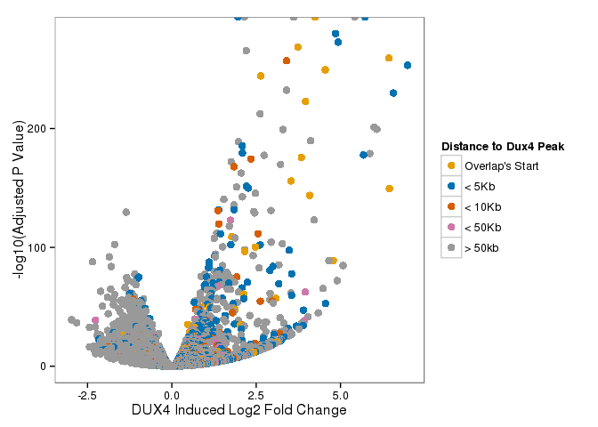
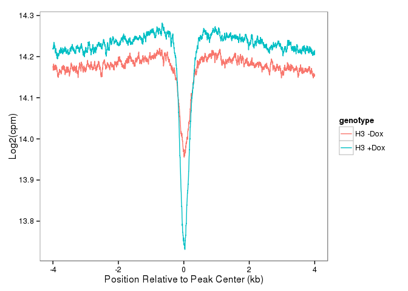
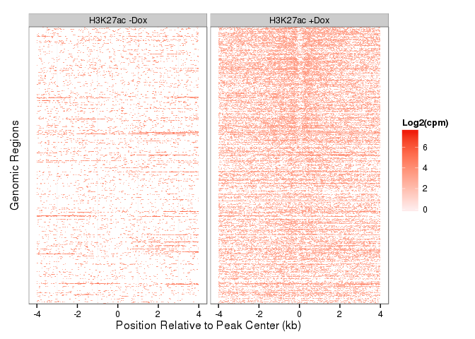
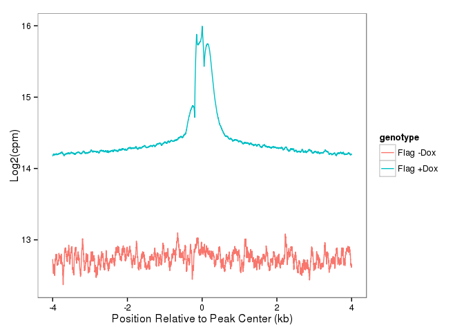
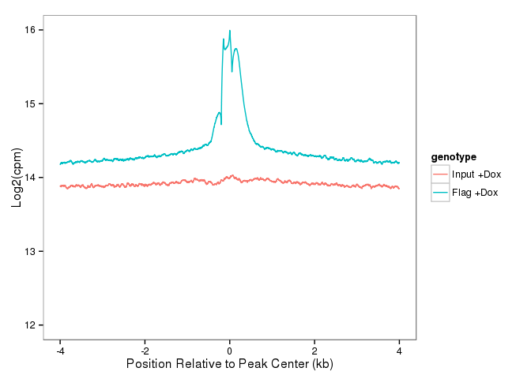

``` r
BiocInstaller::biocLite("Homo.sapiens")
BiocInstaller::biocLite("genefilter")
BiocInstaller::biocLite("goseq")
BiocInstaller::biocLite("TFBSTools")
BiocInstaller::biocLite("MotIV")
BiocInstaller::biocLite("motifRG")
BiocInstaller::biocLite("BiocParallel")
BiocInstaller::biocLite("MotifDb")
```

``` r
library("DESeq2")
```

    ## Loading required package: S4Vectors
    ## Loading required package: stats4
    ## Loading required package: BiocGenerics
    ## Loading required package: parallel
    ## 
    ## Attaching package: 'BiocGenerics'
    ## 
    ## The following objects are masked from 'package:parallel':
    ## 
    ##     clusterApply, clusterApplyLB, clusterCall, clusterEvalQ,
    ##     clusterExport, clusterMap, parApply, parCapply, parLapply,
    ##     parLapplyLB, parRapply, parSapply, parSapplyLB
    ## 
    ## The following object is masked from 'package:stats':
    ## 
    ##     xtabs
    ## 
    ## The following objects are masked from 'package:base':
    ## 
    ##     anyDuplicated, append, as.data.frame, as.vector, cbind,
    ##     colnames, do.call, duplicated, eval, evalq, Filter, Find, get,
    ##     intersect, is.unsorted, lapply, Map, mapply, match, mget,
    ##     order, paste, pmax, pmax.int, pmin, pmin.int, Position, rank,
    ##     rbind, Reduce, rep.int, rownames, sapply, setdiff, sort,
    ##     table, tapply, union, unique, unlist, unsplit
    ## 
    ## Creating a generic function for 'nchar' from package 'base' in package 'S4Vectors'
    ## Loading required package: IRanges
    ## Loading required package: GenomicRanges
    ## Loading required package: GenomeInfoDb
    ## Loading required package: Rcpp
    ## Loading required package: RcppArmadillo

``` r
library("ggplot2")
#library("Homo.sapiens")
#library("genefilter")
library("pheatmap")
#library("goseq")
#library("GenomicFeatures")
library("BiocParallel")
library("GenomicAlignments")
```

    ## Loading required package: Biostrings
    ## Loading required package: XVector
    ## Loading required package: Rsamtools

``` r
library("Rsamtools")
library("rtracklayer")
library("RColorBrewer")
library("dplyr")
```

    ## 
    ## Attaching package: 'dplyr'
    ## 
    ## The following objects are masked from 'package:GenomicAlignments':
    ## 
    ##     first, last
    ## 
    ## The following objects are masked from 'package:Biostrings':
    ## 
    ##     collapse, intersect, setdiff, setequal, union
    ## 
    ## The following object is masked from 'package:XVector':
    ## 
    ##     slice
    ## 
    ## The following objects are masked from 'package:GenomicRanges':
    ## 
    ##     intersect, setdiff, union
    ## 
    ## The following object is masked from 'package:GenomeInfoDb':
    ## 
    ##     intersect
    ## 
    ## The following objects are masked from 'package:IRanges':
    ## 
    ##     collapse, desc, intersect, setdiff, slice, union
    ## 
    ## The following objects are masked from 'package:S4Vectors':
    ## 
    ##     intersect, rename, setdiff, union
    ## 
    ## The following objects are masked from 'package:BiocGenerics':
    ## 
    ##     combine, intersect, setdiff, union
    ## 
    ## The following objects are masked from 'package:stats':
    ## 
    ##     filter, lag
    ## 
    ## The following objects are masked from 'package:base':
    ## 
    ##     intersect, setdiff, setequal, union

``` r
library("tidyr")
```

    ## 
    ## Attaching package: 'tidyr'
    ## 
    ## The following object is masked from 'package:IRanges':
    ## 
    ##     expand

``` r
#library("exotools")
#library("BSgenome.Hsapiens.NCBI.GRCh38")
#hg38<-BSgenome.Hsapiens.NCBI.GRCh38
library(BSgenome.Hsapiens.UCSC.hg19)
```

    ## Loading required package: BSgenome

``` r
hg19<-BSgenome.Hsapiens.UCSC.hg19
library("ChIPpeakAnno")
```

    ## Loading required package: grid
    ## Loading required package: VennDiagram
    ## Loading required package: futile.logger
    ## Loading required package: biomaRt
    ## Loading required package: DBI

``` r
#library("TFBSTools")
#library("MotIV")
#library("biomaRt")
source("R/hello.R")
```

``` r
#Use most recent hg19 build
ensembl_75 = useMart(host = "feb2014.archive.ensembl.org", biomart = "ENSEMBL_MART_ENSEMBL", 
    dataset = "hsapiens_gene_ensembl")        
        
txdb<-makeTxDbFromBiomart(biomart="ENSEMBL_MART_ENSEMBL",host = "feb2014.archive.ensembl.org",dataset="hsapiens_gene_ensembl")
ens75<-exonsBy(txdb,by="gene")
save(ens75,file="ens75.rdata")

(fls <- list.files(".", pattern="GRCh37.q4.bam$",full=TRUE))
register(MulticoreParam(workers=12))
load("ens75.rdata")
bamlst <- BamFileList(fls)
hits_q4 <- summarizeOverlaps(ens75,bamlst,mode="Union",singleEnd=FALSE,ignore.strand=TRUE)
apply(assays(hits_q4)$counts,2,sum)

(fls <- list.files(".", pattern="GRCh37.bam$",full=TRUE))
bamlst <- BamFileList(fls)
hits <- summarizeOverlaps(ens75,bamlst,mode="Union",singleEnd=FALSE,ignore.strand=TRUE)
apply(assays(hits)$counts,2,sum)
save(hits_q4,hits,file="GRCh37_hits.rdata")
```

``` r
load("../rna/GRCh37_hits.rdata")
load("hgnc.rdata")

cds<-DESeqDataSet(hits_q4,design=~1)
colnames(cds)<-sapply(strsplit(colnames(cds),"_"),function(x) x[1])
cds$dox<-as.factor(rep(c("nodox","plusdox"),each=3))
design(cds)<-(~dox)

plotPCA( DESeqTransform( cds ) ,intgroup = c("dox"))+
  ggtitle("Dux4 Inducible RNA-Seq") + theme_bw()
```


``` r
cds<-DESeq(cds)
```

    ## estimating size factors
    ## estimating dispersions
    ## gene-wise dispersion estimates
    ## mean-dispersion relationship
    ## final dispersion estimates
    ## fitting model and testing

``` r
plotMA(cds,ylim=c(-8,8))
```


``` r
#results
res<-results(cds)
res<-as.data.frame(res)

#get annotations
#ensembl_83 = useMart(biomart="ENSEMBL_MART_ENSEMBL", host="www.ensembl.org", path="/biomart/martservice",dataset="hsapiens_gene_ensembl")
#hgnc<-getBM(filters="ensembl_gene_id",values=rownames(res),
#      attributes=c("ensembl_gene_id","hgnc_symbol"),mart=ensembl_83)
#save(hgnc,file="hgnc.rdata")
idx<-match(rownames(res),hgnc$ensembl_gene_id)
res$hgnc<-hgnc[idx,"hgnc_symbol"]
res<-res[!is.na(res$padj),]
res<-res[with(res,order(padj,-log2FoldChange)),]
res[grep("ZSCAN4",res$hgnc),]
```

    ##                 baseMean log2FoldChange     lfcSE     stat pvalue padj
    ## ENSG00000180532 14101.19       5.727479 0.1434848 39.91697      0    0
    ##                   hgnc
    ## ENSG00000180532 ZSCAN4

``` r
#plot(res$log2FoldChange,-1*log10(res$padj),cex=0.5,pch=16)


#11-17-15
f<-as.data.frame(fpkm(cds))
idx<-match(rownames(f),hgnc$ensembl_gene_id)
f$hgnc<-hgnc[idx,2]
head(f)
```

    ##                 LHCNM2iDUX4HTFCtrl1 LHCNM2iDUX4HTFCtrl2
    ## ENSG00000000003            6.854749          6.39278449
    ## ENSG00000000005            0.000000          0.00000000
    ## ENSG00000000419           37.752066         36.37772977
    ## ENSG00000000457            1.079787          0.94388599
    ## ENSG00000000460            3.568490          3.68965182
    ## ENSG00000000938            0.000000          0.02859504
    ##                 LHCNM2iDUX4HTFCtrl3 LHCNM2iDUX4HTFDox1 LHCNM2iDUX4HTFDox2
    ## ENSG00000000003            7.080320           7.088413         7.45516837
    ## ENSG00000000005            0.000000           0.000000         0.00000000
    ## ENSG00000000419           36.583945          40.944085        37.32635279
    ## ENSG00000000457            1.039686           1.318591         1.39446488
    ## ENSG00000000460            3.616018           3.712998         3.57909615
    ## ENSG00000000938            0.000000           0.000000         0.02653874
    ##                 LHCNM2iDUX4HTFDox3     hgnc
    ## ENSG00000000003           7.843839   TSPAN6
    ## ENSG00000000005           0.000000     TNMD
    ## ENSG00000000419          40.718931     DPM1
    ## ENSG00000000457           1.294814    SCYL3
    ## ENSG00000000460           3.351488 C1orf112
    ## ENSG00000000938           0.000000      FGR

``` r
f[grep("ZSCAN4",f$hgnc),]
```

    ##                 LHCNM2iDUX4HTFCtrl1 LHCNM2iDUX4HTFCtrl2
    ## ENSG00000180532            5.379873            6.663893
    ##                 LHCNM2iDUX4HTFCtrl3 LHCNM2iDUX4HTFDox1 LHCNM2iDUX4HTFDox2
    ## ENSG00000180532            6.528728           433.8269           440.2072
    ##                 LHCNM2iDUX4HTFDox3   hgnc
    ## ENSG00000180532           335.6007 ZSCAN4

``` r
f[grep("MYOD1",f$hgnc),]
```

    ##                 LHCNM2iDUX4HTFCtrl1 LHCNM2iDUX4HTFCtrl2
    ## ENSG00000129152            47.69161            49.51331
    ##                 LHCNM2iDUX4HTFCtrl3 LHCNM2iDUX4HTFDox1 LHCNM2iDUX4HTFDox2
    ## ENSG00000129152            51.12213           4.697423           4.624283
    ##                 LHCNM2iDUX4HTFDox3  hgnc
    ## ENSG00000129152            9.93699 MYOD1

``` r
write.csv(f,file="Supplementary_Table_1.csv",quote=F)
```

Michael would like to know how much overlap with the tapscott dataset and does that number change if peaks are called against input vs flag-control.
====================================================================================================================================================

``` r
#hg19blacklist
hg19bl<-rtracklayer::import("hg19_blacklist.bed")

dux4_tap<-rtracklayer::import("../sra/dux4_fl_pe5_peaks.bed")
dux4_tap<-keepSeqlevels(dux4_tap,seqlevels(hg19)[1:24])
length(dux4_tap<-dux4_tap[!dux4_tap %over% hg19bl])
```

    ## [1] 134196

``` r
dux4_vs_input<-rtracklayer::import("DUX4Dox.bed")
dux4_vs_input<-keepSeqlevels(dux4_vs_input,seqlevels(hg19)[1:24])
length(dux4_vs_input<-dux4_vs_input[!dux4_vs_input %over% hg19bl])
```

    ## [1] 12674

``` r
dux4_vs_flag<-rtracklayer::import("../chip/DUX4_vs_flag_pe5_peaks.bed")
dux4_vs_flag<-keepSeqlevels(dux4_vs_flag,seqlevels(hg19)[1:24])
length(dux4_vs_flag<-dux4_vs_flag[!dux4_vs_flag %over% hg19bl])
```

    ## [1] 26025

``` r
mean(dux4_vs_flag[dux4_vs_flag$score > 40] %over% dux4_tap)
```

    ## [1] 0.1820557

``` r
mean(dux4_vs_input[dux4_vs_input$score > 40] %over% dux4_tap)
```

    ## [1] 0.1731892

``` r
mean(dux4_tap %over% dux4_vs_flag)
```

    ## [1] 0.03676712

``` r
#tss<-getAnnotation(ensembl_75,featureType="TSS",output="GRanges")
#save(tss,file="tss.rdata")
load("tss.rdata")
dux4_vs_flag_anno <- annotatePeakInBatch(dux4_vs_flag, AnnotationData=tss, output="nearest", maxgap=100L)
summary(dux4_vs_flag_anno$shortestDistance)
```

    ##    Min. 1st Qu.  Median    Mean 3rd Qu.    Max. 
    ##       0    8449   24770   45740   58680 2214000

``` r
#res$peak10kb<-rownames(res) %in% unique(dux4_vs_flag_anno$feature)
res$peak10kb<-"> 50kb"
overs<-unique(dux4_vs_flag_anno[dux4_vs_flag_anno$insideFeature=="overlapStart",]$feature)
fivekb<-unique(dux4_vs_flag_anno[dux4_vs_flag_anno$shortestDistance < 5000,]$feature)
fivekb<-fivekb[!fivekb %in% overs]
tenkb<-unique(dux4_vs_flag_anno[dux4_vs_flag_anno$shortestDistance < 10000,]$feature)
tenkb<-tenkb[!(tenkb %in% fivekb) & !(tenkb %in% overs)]
fiftykb<-unique(dux4_vs_flag_anno[dux4_vs_flag_anno$shortestDistance < 50000,]$feature)
fiftykb<-tenkb[!(fiftykb %in% tenkb) & !(fiftykb %in% fivekb) & !(fiftykb %in% overs)]
res[rownames(res) %in% overs,"peak10kb"]<-"Overlap's Start"
res[rownames(res) %in% fivekb,"peak10kb"]<-"< 5Kb"
res[rownames(res) %in% tenkb,"peak10kb"]<-"< 10Kb"
res[rownames(res) %in% fiftykb,"peak10kb"]<-"< 50Kb"
table(res$peak10kb)
```

    ## 
    ##          < 10Kb          > 50kb          < 50Kb           < 5Kb 
    ##             367           16490             276            1338 
    ## Overlap's Start 
    ##             186

``` r
cbPalette <- c("#999999", "#E69F00", "#56B4E9", "#009E73", "#F0E442", "#0072B2", "#D55E00", "#CC79A7")

res %>% 
  mutate(mlogp=-1*log10(padj)) %>% 
  mutate(peak10kb=factor(peak10kb,levels=c("Overlap's Start","< 5Kb","< 10Kb","< 50Kb","> 50kb"))) %>% 
  ggplot(aes(x=log2FoldChange,y=mlogp,color=peak10kb)) +
  geom_point(size=3) + scale_color_manual(values=cbPalette[c(2,6,7,8,1)],
                                    name="Distance to Dux4 Peak") +
  xlab("DUX4 Induced Log2 Fold Change")+
  ylab("-log10(Adjusted P Value)") +
 # scale_alpha_continuous(range = c(1.0, 1.0))+
  theme_bw() + theme(panel.grid.major=element_blank(),
                     panel.grid.minor=element_blank())
```



Use the rlog to find some high variance genes that aren't likely do to noise.
=============================================================================

``` r
rld <- rlog(cds, blind=FALSE)
hist(res$pvalue[res$baseMean > 1], breaks=0:20/20, col="grey50", border="white")

topVarGenes <- head(order(rowVars(assay(rld)),decreasing=TRUE),50)
mat <- assay(rld)[ topVarGenes, ]
#mean center
mat <- mat - rowMeans(mat)

#or Z-scores
#mat <- (mat - rowMeans(mat))/rowSds(mat)

df <- as.data.frame(colData(rld)[,c("dox")])
colnames(df)<-"Condition"
dr <- AnnotationDbi::select(Homo.sapiens,keys=rownames(mat),keytype="ENSEMBL",columns="SYMBOL")
dr<-dr[!is.na(dr$SYMBOL),]
dr<-dr[!duplicated(dr$ENSEMBL),]

#show only genes that have symbols
colnames(mat)<-1:6
mat<-mat[rownames(mat) %in% dr$ENSEMBL,]
idx<-match(rownames(mat),dr$ENSEMBL)

pheatmap(mat, annotation_col=df,labels_row=dr[idx,"SYMBOL"])
```

Genome Distribution
===================

``` r
(resGR <- results(cds, lfcThreshold=1, format="GRanges"))
resGR<-resGR[!is.na(resGR$log2FoldChange)]
resGR<-resGR[abs(resGR$log2FoldChange) > 2]
resGR<-keepSeqlevels(resGR,c(1:22,"X","Y"))
length(resGR) #1190

hg38IdeogramCyto <- getIdeogram("hg38", cytoband = TRUE)
#seqlevelsStyle(hg38IdeogramCyto)<-"NCBI"
hg38IdeogramCyto<-keepSeqlevels(hg38IdeogramCyto,c(1:22,"X","Y"))
seqlengths(hg38IdeogramCyto)

ggplot(hg38IdeogramCyto) + layout_karyogram(cytoband = FALSE)  + theme_bw() +
  layout_karyogram(resGR, geom = "rect", ylim = c(11, 21),color = "red")
```

GOseq for enriched Terms
========================

``` r
res<-results(cds)
res<-as.data.frame(res)
res<-res[!is.na(res$padj),]
head(res)

gocat<-AnnotationDbi::select(Homo.sapiens,keys=rownames(res),keytype="ENSEMBL",columns="GOID")

#gocat<-gocat[!is.na(gocat$ENSEMBL),]
#sum(is.na(gocat$ENTREZID))
gocat<-gocat[gocat$ONTOLOGY=="BP",c("ENSEMBL","GOID")]
str(gocat)
gocat$GOID<-as.character(gocat$GOID)
#gocat2<-do.call( rbind, lapply( rownames(gocat)[1:20], testCategory ) )
gocat.list<-split(gocat$GOID,gocat$ENSEMBL)
gocat.list[["ENSG00000183337"]]

#bias.data
bd<-sum(width(reduce(ex)))
bd["ENSG00000183337"]
bd<-bd[names(bd) %in% rownames(res)]

degs<-as.numeric(res$padj < 0.05 & abs(res$log2FoldChange) > 1)
names(degs)<-rownames(res)
table(degs)

pwf<-nullp(degs,bias.data=bd)
GO.wall<-goseq(pwf,gene2cat=gocat.list)

head(GO.wall,20) %>%
  mutate(term=factor(term,levels=rev(term))) %>%
ggplot(aes(x=term,y=-log10(over_represented_pvalue))) +
  geom_bar(stat="identity",fill="red") +
  coord_flip() + xlab("") +
  theme_bw() 

temp<-GO.wall[GO.wall$over_represented_pvalue < 0.05,1:2]
rownames(temp)<-temp$category
temp<-temp[,-1,drop=F]
View(temp)

listGO<-function(goid) {
print(OrganismDbi::select(Homo.sapiens,keys=goid,keytype="GOID",columns="TERM"))
tg<-OrganismDbi::select(Homo.sapiens,keys=gocat[grep(goid,gocat$GOID),"ENSEMBL"],keytype="ENSEMBL",columns="SYMBOL")
tg$deg<-degs[tg$ENSEMBL]
tg
}

listGO("GO:0045596")
```

``` r
length(dux4dox<-import("../chip/DUX4dox_pe5_summits.bed"))
dux4dox_1k<-dux4dox+500
dux4dox_4k<-dux4dox+2000

(fls <- list.files("../chip", pattern=glob2rx("*hg19.bam$"),full=TRUE))
#(fls <- list.files("../chip", pattern=glob2rx("h3k27*hg19.bam$"),full=TRUE))
#(fls2 <- list.files("../chip", pattern=glob2rx("DUX*hg19.bam$"),full=TRUE))
bamlst <- BamFileList(fls,yieldSize = 1e5)
detectCores()
BiocParallel::register(MulticoreParam(workers=detectCores()))
system.time(dux4dox_1k_counts <- summarizeOverlaps(dux4dox_1k,bamlst,mode="Union",singleEnd=TRUE,ignore.strand=TRUE))
system.time(dux4dox_4k_counts <- summarizeOverlaps(dux4dox_4k,bamlst,mode="Union",singleEnd=TRUE,ignore.strand=TRUE))

apply(assays(dux4dox_1k_counts)$counts,2,sum)
apply(assays(dux4dox_4k_counts)$counts,2,sum)
save(dux4dox_1k_counts,dux4dox_4k_counts,file="DUX4_counts.rdata")
```

``` r
load("DUX4_counts.rdata")


dux4dox_1k<-rowRanges(dux4dox_1k_counts)
(n<-apply(assays(dux4dox_1k_counts)$counts,2,sum))
```

    ##          DUX4.R1_trimmed.fastq.hg19.bam 
    ##                                 3153598 
    ##   h3k27_nodox.R1_trimmed.fastq.hg19.bam 
    ##                                  580689 
    ## h3k27_plusdox.R1_trimmed.fastq.hg19.bam 
    ##                                 1020129 
    ##      h3_nodox.R1_trimmed.fastq.hg19.bam 
    ##                                 4001829 
    ##    h3_plusdox.R1_trimmed.fastq.hg19.bam 
    ##                                 3749309 
    ##   input_nodox.R1_trimmed.fastq.hg19.bam 
    ##                                  487774 
    ## input_plusdox.R1_trimmed.fastq.hg19.bam 
    ##                                  445714

``` r
x<-which(grepl("input",names(n)))
temp<-apply(assays(dux4dox_1k_counts)$counts[,x],1,mean)
dux4dox_1k$input<-log2(temp*10e6/sum(temp)+1)

x<-which(grepl("h3k27_nodox",names(n)))
dux4dox_1k$k27nd<-log2(assays(dux4dox_1k_counts)$counts[,x]*10e6/n[x]+1)
x<-which(grepl("h3k27_plusdox",names(n)))
dux4dox_1k$k27pd<-log2(assays(dux4dox_1k_counts)$counts[,x]*10e6/n[x]+1)
x<-which(grepl("DUX4",names(n)))
dux4dox_1k$dux4<-log2(assays(dux4dox_1k_counts)$counts[,x]*10e6/n[x]+1)
#quantro::matdensity(as.matrix(mcols(dux4dox_1k)[,3:6]))
#abline(v=9)
#clean up
length(dux4dox_1k<-keepSeqlevels(dux4dox_1k,seqlevels(hg19)[1:24])) #remove small contigs
```

    ## [1] 31570

``` r
length(dux4dox_1k<-dux4dox_1k[!dux4dox_1k %over% hg19bl])  #remove black listed regions
```

    ## [1] 31545

``` r
length(dux4dox_1k<-dux4dox_1k[dux4dox_1k$input < 9])  # remove regions with excessive reads in input 
```

    ## [1] 30843

``` r
#Load DNAse data

dnase<-read.table("ENCFF001BVR.bed",stringsAsFactors=FALSE)
dnase<-GRanges(seqnames=dnase$V1,IRanges(start=dnase$V2,end=dnase$V3),score=dnase$V7,score2=dnase$V8)

dux4dox_1k$dnase_overlap <- dux4dox_1k %over% dnase
```

Analyze ChIP Data
=================

``` r
h3k27<-new("fileset", filename=c( "../chip/h3k27_nodox.R1_trimmed.fastq.hg19.bam",
                                  "../chip/h3k27_plusdox.R1_trimmed.fastq.hg19.bam"),
           labels=c("H3K27ac -Dox","H3K27ac +Dox"))
(h3k27<-countFileset(h3k27))

DUX4<-new("fileset",filename=c("../chip/flag_s95_nodox.R1_trimmed.fastq.hg19.bam",
                               "../chip/DUX4.R1_trimmed.fastq.hg19.bam"),
           labels=c("Flag -Dox","Flag +Dox"))
(DUX4<-countFileset(DUX4))

H3<-new("fileset", filename=c( "../chip/h3_nodox.R1_trimmed.fastq.hg19.bam",
                                  "../chip//h3_plusdox.R1_trimmed.fastq.hg19.bam"),
           labels=c("H3 -Dox","H3 +Dox"))
(H3<-countFileset(H3))

#h3k4<-new("fileset",filename=c("../chip/h3k4me_s91_nodox.R1_trimmed.fastq.hg19.bam",
#           "../chip/h3k4me_s92_plusdox.R1_trimmed.fastq.hg19.bam"),
#           labels=c("H3K4me3 -Dox","H3K4me3 +Dox"))
#(h3k4<-countFileset(h3k4))
#
#p300<-new("fileset",filename=c("../chip/p300_s93_nodox.R1_trimmed.fastq.hg19.bam",
#          "../chip/p300_s94_plusdox.R1_trimmed.fastq.hg19.bam"),
#           labels=c("P300 -Dox","P300 +Dox"))
#(p300<-countFileset(p300))

#save(h3k27,H3,h3k4,p300,DUX4,file="filesets.rdata")
save(h3k27,H3,DUX4,file="filesets.rdata")
```

``` r
load("filesets.rdata")

length(temp<-dux4dox_1k[dux4dox_1k$dnase_overlap==TRUE])
```

    ## [1] 12846

``` r
#length(temp<-dux4dox_1k[dux4dox_1k$dnase_overlap==TRUE & dux4dox_1k$score > 35])
#temp<-sample(temp,500)
temp<-temp[with(temp,order(-score))]
#benchplot(tornado(temp,dataset=DUX4,pad = 3500,ord=0,window=5,color="blue"))
#benchplot(tornado(temp,dataset=h3k4,pad = 3500,ord=0,window=5,color="darkorange4"))
```

``` r
benchplot(tornado(temp,dataset=h3k27,pad = 3500,ord=0,window=5,color="red2"))
```


    ##        step user.self sys.self  elapsed
    ## 1 construct   703.405   13.448  726.604
    ## 2     build   141.834    0.182  142.071
    ## 3    render    21.996    0.000   22.005
    ## 4      draw   133.645    0.000  133.693
    ## 5     TOTAL  1000.880   13.630 1024.373

``` r
#benchplot(tornado(temp,dataset=p300,pad = 3500,ord=0,window=5,color="red2"))
```

``` r
benchplot(twister(temp,dataset=H3,pad = 3500,ord=0,window=1,color="darkgreen"))
```



    ##        step user.self sys.self  elapsed
    ## 1 construct  1090.535   19.872 1252.731
    ## 2     build     0.052    0.000    0.052
    ## 3    render     0.108    0.000    0.108
    ## 4      draw     0.067    0.000    0.067
    ## 5     TOTAL  1090.762   19.872 1252.958

``` r
length(temp2<-dux4dox_1k[dux4dox_1k$dnase_overlap==FALSE ])
```

    ## [1] 17997

``` r
#length(temp2<-dux4dox_1k[dux4dox_1k$dnase_overlap==FALSE & dux4dox_1k$score > 35])
#temp<-sample(temp,500)
temp2<-temp2[with(temp2,order(-score))]
#benchplot(tornado(temp2,dataset=DUX4,pad = 3500,ord=0,window=5,color="blue"))
#benchplot(tornado(temp2,dataset=h3k4,pad = 3500,ord=0,window=5,color="darkorange4"))
benchplot(tornado(temp2,dataset=h3k27,pad = 3500,ord=0,window=5,color="red2"))
```



    ##        step user.self sys.self elapsed
    ## 1 construct   537.147    1.420 540.956
    ## 2     build   124.349    0.297 124.697
    ## 3    render    19.791    0.076  19.876
    ## 4      draw   117.018    0.243 117.308
    ## 5     TOTAL   798.305    2.036 802.837

``` r
#benchplot(tornado(temp2,dataset=h3k27,pad = 3500,ord=0,window=5,color="red2"))
#benchplot(tornado(temp2,dataset=p300,pad = 3500,ord=0,window=5,color="red2"))
benchplot(twister(temp,dataset=DUX4,pad = 3500,ord=0,window=1,color="darkgreen"))
```


    ##        step user.self sys.self elapsed
    ## 1 construct   387.934    2.954 421.053
    ## 2     build     0.049    0.000   0.049
    ## 3    render     0.106    0.000   0.106
    ## 4      draw     0.065    0.000   0.065
    ## 5     TOTAL   388.154    2.954 421.273

``` r
benchplot(twister(temp2,dataset=DUX4,pad = 3500,ord=0,window=1,color="darkgreen"))
```



    ##        step user.self sys.self elapsed
    ## 1 construct   552.123    2.402 560.901
    ## 2     build     0.050    0.001   0.051
    ## 3    render     0.103    0.001   0.104
    ## 4      draw     0.063    0.002   0.065
    ## 5     TOTAL   552.339    2.406 561.121

``` r
benchplot(twister(temp2,dataset=H3,pad = 3500,ord=0,window=5,color="blue"))
```



    ##        step user.self sys.self  elapsed
    ## 1 construct  1485.872   14.163 1559.973
    ## 2     build     0.037    0.000    0.037
    ## 3    render     0.087    0.000    0.087
    ## 4      draw     0.160    0.000    0.160
    ## 5     TOTAL  1486.156   14.163 1560.257

``` r
load("h3k27_counts.rdata")
(n<-apply(assays(h3k27_counts)$counts,2,sum))
length(gr<-rowRanges(h3k27_counts))
gr$k27nd<-log2(assays(h3k27_counts)$counts[,1]*10e6/n[1] + 1)
gr$k27pd<-log2(assays(h3k27_counts)$counts[,2]*10e6/n[2] + 1)
head(gr)
plot(gr$k27pd,gr$k27nd,cex=0.2,pch=16)
#x<-as.matrix(mcols(gr))
#matdensity(x)

#look at subset
length(gr_subset<-gr[gr$k27nd > 8 | gr$k27pd > 8])
gr_subset$which_label<-wls(gr_subset)
plot(gr_subset$k27pd,gr_subset$k27nd,cex=0.2,pch=16)
#x<-as.matrix(mcols(gr_subset[,1:2]))
#matdensity(x)

gr_subset$ratio <- gr_subset$k27pd - gr_subset$k27nd
gr_subset<-gr_subset[with(gr_subset,order(-ratio))]
head(gr_subset)

gr_subset[gr_subset %over% GRanges(seqnames="chr19",IRanges(start=58178303,end=58192520))]

#chr11:17,728,386-17,756,401
gr_subset[gr_subset %over% GRanges(seqnames="chr11",IRanges(start=17728386,end=17756401))]

#length(gr_subset_subset<-gr_subset[abs(gr_subset$ratio)>2])
length(gr_subset_subset<-gr_subset)

length(gr_subset_subset<-gr_subset_subset[width(gr_subset_subset)<5000])
```

``` r
sessionInfo()
```

    ## R version 3.2.2 (2015-08-14)
    ## Platform: x86_64-pc-linux-gnu (64-bit)
    ## Running under: CentOS release 6.7 (Final)
    ## 
    ## locale:
    ##  [1] LC_CTYPE=en_US.UTF-8       LC_NUMERIC=C              
    ##  [3] LC_TIME=en_US.UTF-8        LC_COLLATE=en_US.UTF-8    
    ##  [5] LC_MONETARY=en_US.UTF-8    LC_MESSAGES=en_US.UTF-8   
    ##  [7] LC_PAPER=en_US.UTF-8       LC_NAME=C                 
    ##  [9] LC_ADDRESS=C               LC_TELEPHONE=C            
    ## [11] LC_MEASUREMENT=en_US.UTF-8 LC_IDENTIFICATION=C       
    ## 
    ## attached base packages:
    ##  [1] grid      parallel  stats4    stats     graphics  grDevices utils    
    ##  [8] datasets  methods   base     
    ## 
    ## other attached packages:
    ##  [1] ChIPpeakAnno_3.2.2                RSQLite_1.0.0                    
    ##  [3] DBI_0.3.1                         biomaRt_2.24.1                   
    ##  [5] VennDiagram_1.6.16                futile.logger_1.4.1              
    ##  [7] BSgenome.Hsapiens.UCSC.hg19_1.4.0 BSgenome_1.36.3                  
    ##  [9] tidyr_0.3.1                       dplyr_0.4.3                      
    ## [11] RColorBrewer_1.1-2                rtracklayer_1.28.10              
    ## [13] GenomicAlignments_1.4.2           Rsamtools_1.20.5                 
    ## [15] Biostrings_2.36.4                 XVector_0.8.0                    
    ## [17] BiocParallel_1.2.22               pheatmap_1.0.7                   
    ## [19] ggplot2_1.0.1                     DESeq2_1.8.2                     
    ## [21] RcppArmadillo_0.6.200.2.0         Rcpp_0.12.1                      
    ## [23] GenomicRanges_1.20.8              GenomeInfoDb_1.4.3               
    ## [25] IRanges_2.2.9                     S4Vectors_0.6.6                  
    ## [27] BiocGenerics_0.14.0              
    ## 
    ## loaded via a namespace (and not attached):
    ##  [1] Biobase_2.28.0         splines_3.2.2          Formula_1.2-1         
    ##  [4] assertthat_0.1         latticeExtra_0.6-26    RBGL_1.44.0           
    ##  [7] yaml_2.1.13            lattice_0.20-33        limma_3.24.15         
    ## [10] digest_0.6.8           colorspace_1.2-6       htmltools_0.2.6       
    ## [13] plyr_1.8.3             XML_3.98-1.3           genefilter_1.50.0     
    ## [16] zlibbioc_1.14.0        GO.db_3.1.2            xtable_1.8-0          
    ## [19] scales_0.3.0           annotate_1.46.1        GenomicFeatures_1.20.6
    ## [22] lazyeval_0.1.10        nnet_7.3-11            proto_0.3-10          
    ## [25] survival_2.38-3        magrittr_1.5           evaluate_0.8          
    ## [28] MASS_7.3-44            foreign_0.8-66         graph_1.46.0          
    ## [31] BiocInstaller_1.18.5   tools_3.2.2            formatR_1.2.1         
    ## [34] stringr_1.0.0          munsell_0.4.2          locfit_1.5-9.1        
    ## [37] cluster_2.0.3          AnnotationDbi_1.30.1   lambda.r_1.1.7        
    ## [40] RCurl_1.95-4.7         labeling_0.3           bitops_1.0-6          
    ## [43] rmarkdown_0.8.1        gtable_0.1.2           multtest_2.24.0       
    ## [46] reshape2_1.4.1         R6_2.1.1               gridExtra_2.0.0       
    ## [49] knitr_1.11             Hmisc_3.17-0           futile.options_1.0.0  
    ## [52] stringi_1.0-1          geneplotter_1.46.0     rpart_4.1-10          
    ## [55] acepack_1.3-3.3
