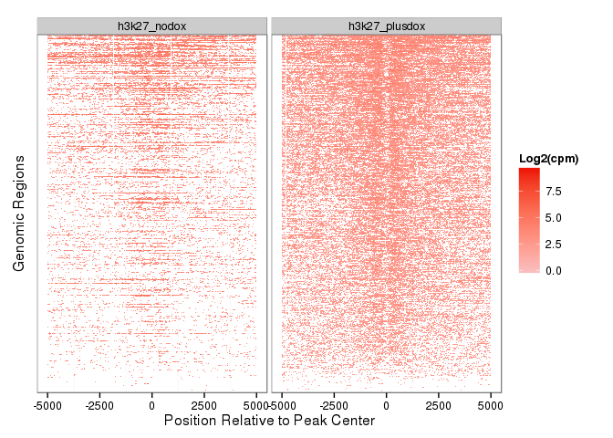

``` r
BiocInstaller::biocLite("Homo.sapiens")
BiocInstaller::biocLite("genefilter")
BiocInstaller::biocLite("goseq")
BiocInstaller::biocLite("TFBSTools")
BiocInstaller::biocLite("MotIV")
BiocInstaller::biocLite("motifRG")
BiocInstaller::biocLite("BiocParallel")
BiocInstaller::biocLite("MotifDb")
```

``` r
#library("DESeq2")
library("ggplot2")
#library("Homo.sapiens")
#library("genefilter")
#library("pheatmap")
#library("goseq")
#library("GenomicFeatures")
library("GenomicAlignments")
```

    ## Loading required package: BiocGenerics
    ## Loading required package: parallel
    ## 
    ## Attaching package: 'BiocGenerics'
    ## 
    ## The following objects are masked from 'package:parallel':
    ## 
    ##     clusterApply, clusterApplyLB, clusterCall, clusterEvalQ,
    ##     clusterExport, clusterMap, parApply, parCapply, parLapply,
    ##     parLapplyLB, parRapply, parSapply, parSapplyLB
    ## 
    ## The following object is masked from 'package:stats':
    ## 
    ##     xtabs
    ## 
    ## The following objects are masked from 'package:base':
    ## 
    ##     anyDuplicated, append, as.data.frame, as.vector, cbind,
    ##     colnames, do.call, duplicated, eval, evalq, Filter, Find, get,
    ##     intersect, is.unsorted, lapply, Map, mapply, match, mget,
    ##     order, paste, pmax, pmax.int, pmin, pmin.int, Position, rank,
    ##     rbind, Reduce, rep.int, rownames, sapply, setdiff, sort,
    ##     table, tapply, union, unique, unlist, unsplit
    ## 
    ## Loading required package: S4Vectors
    ## Loading required package: stats4
    ## Creating a generic function for 'nchar' from package 'base' in package 'S4Vectors'
    ## Loading required package: IRanges
    ## Loading required package: GenomeInfoDb
    ## Loading required package: GenomicRanges
    ## Loading required package: Biostrings
    ## Loading required package: XVector
    ## Loading required package: Rsamtools

``` r
library("Rsamtools")
library("rtracklayer")
library("RColorBrewer")
library("dplyr")
```

    ## 
    ## Attaching package: 'dplyr'
    ## 
    ## The following objects are masked from 'package:GenomicAlignments':
    ## 
    ##     first, last
    ## 
    ## The following objects are masked from 'package:Biostrings':
    ## 
    ##     collapse, intersect, setdiff, setequal, union
    ## 
    ## The following object is masked from 'package:XVector':
    ## 
    ##     slice
    ## 
    ## The following objects are masked from 'package:GenomicRanges':
    ## 
    ##     intersect, setdiff, union
    ## 
    ## The following object is masked from 'package:GenomeInfoDb':
    ## 
    ##     intersect
    ## 
    ## The following objects are masked from 'package:IRanges':
    ## 
    ##     collapse, desc, intersect, setdiff, slice, union
    ## 
    ## The following objects are masked from 'package:S4Vectors':
    ## 
    ##     intersect, rename, setdiff, union
    ## 
    ## The following objects are masked from 'package:BiocGenerics':
    ## 
    ##     combine, intersect, setdiff, union
    ## 
    ## The following objects are masked from 'package:stats':
    ## 
    ##     filter, lag
    ## 
    ## The following objects are masked from 'package:base':
    ## 
    ##     intersect, setdiff, setequal, union

``` r
#library("exotools")
#library("BSgenome.Hsapiens.NCBI.GRCh38")
#hg38<-BSgenome.Hsapiens.NCBI.GRCh38
#library("TFBSTools")
#library("MotIV")
#library("biomaRt")
```

use biomart to build a GRanges Object from GTF file
===================================================

``` r
ensembl_81 = useMart(biomart="ENSEMBL_MART_ENSEMBL", host="www.ensembl.org", path="/biomart/martservice",dataset="hsapiens_gene_ensembl")
txdb<-makeTxDbFromBiomart(biomart="ENSEMBL_MART_ENSEMBL",host="www.ensembl.org",dataset="hsapiens_gene_ensembl")
ens81<-exonsBy(txdb,by="gene")

txdb <- makeTxDbFromBiomart(host = "www.ensembl.org", path="/biomart/martservice",
    biomart = "ENSEMBL_MART_ENSEMBL", dataset = "hsapiens_gene_ensembl")
```

txDb doesn't work?
==================

``` r
#download.file("ftp://ftp.ensembl.org/pub/release-81/fasta/homo_sapiens/cdna/Homo_sapiens.GRCh38.cdna.all.fa.gz",destfile="Homo_sapiens.GRCh38.cdna.all.fa.gz")

download.file("ftp://ftp.ensembl.org/pub/release-81/gtf/homo_sapiens/Homo_sapiens.GRCh38.81.gtf.gz",destfile="Homo_sapiens.GRCh38.81.gtf.gz")
R.utils::gunzip("Homo_sapiens.GRCh38.81.gtf.gz")
tx<-GenomicFeatures::makeTxDbFromGFF("Homo_sapiens.GRCh38.81.gtf",format="gtf")
saveDb(tx,"tx81.db")
tx<-loadDb("tx81.db")
ex<-exonsBy(tx,by="gene")
```

EDA with STAR counts
====================

``` r
load("inst/extdata/LHCNM2iDUX4HTF.rdata")
colnames(e)<-sapply(strsplit(colnames(e),"_"),function(x) x[1])
cd<-as.data.frame(colnames(e))
cd$dox<-as.factor(rep(c("nodox","plusdox"),each=3))
cds<-DESeqDataSetFromMatrix(countData=e,colData=cd,design=~dox)
plotPCA( DESeqTransform( cds ) ,intgroup = c("dox"))+
  ggtitle("Dux4 Inducible RNA-Seq") + theme_bw()
cds<-DESeq(cds)
plotMA(cds,ylim=c(-8,8))
```

Annotation Hub vs Biomart - I usually use AnnotationDbi for extracting gene symbol but it is not using the latest HGNC data and is improperly assigning symbols to DEFB genes.
==============================================================================================================================================================================

``` r
#AnnotationDbi Version
AnnotationDbi::select(Homo.sapiens,keys=c("ENSG00000176797","ENSG00000177243"),keytype="ENSEMBL",columns="SYMBOL")

#Biomart Version
ensembl_81 = useMart(biomart="ENSEMBL_MART_ENSEMBL", host="www.ensembl.org", path="/biomart/martservice",dataset="hsapiens_gene_ensembl")

getBM(filters="ensembl_gene_id",values=c("ENSG00000176797","ENSG00000177243","ENSG00000183337"),
      attributes=c("ensembl_gene_id","hgnc_symbol","band", "chromosome_name","transcript_length"),
      mart=ensembl_81)

hgnc<-getBM(filters="ensembl_gene_id",values=c("ENSG00000176797","ENSG00000177243"),
      attributes=c("ensembl_gene_id","hgnc_symbol"),mart=ensembl_81)

gene_lengths<-getBM(filters="ensembl_gene_id",values=rownames(res),
      attributes=c("ensembl_gene_id","transcript_length"), mart=ensembl_81) 

gene_lengths2<- gene_lengths %>%  group_by(ensembl_gene_id) %>%  summarize(genelength=max(transcript_length))
```

Heatmap of genes that have high variance.
=========================================

``` r
rld <- rlog(cds, blind=FALSE)
hist(res$pvalue[res$baseMean > 1], breaks=0:20/20, col="grey50", border="white")

topVarGenes <- head(order(rowVars(assay(rld)),decreasing=TRUE),40)
mat <- assay(rld)[ topVarGenes, ]
#mean center
mat <- mat - rowMeans(mat)

#or Z-scores
#mat <- (mat - rowMeans(mat))/rowSds(mat)

df <- as.data.frame(colData(rld)[,c("dox")])
colnames(df)<-"Condition"
dr <- select(Homo.sapiens,keys=rownames(mat),keytype="ENSEMBL",columns="SYMBOL")
idx<-match(rownames(mat),dr$ENSEMBL)

pheatmap(mat, annotation_col=df,labels_row=dr[idx,"SYMBOL"])
```

Output a Results Table
======================

``` r
res<-results(cds)
res<-as.data.frame(res)
res<-res[!is.na(res$padj),]
head(res)
blah<-AnnotationDbi::select(Homo.sapiens,keys=rownames(res),
                            keytype="ENSEMBL",columns=c("SYMBOL","MAP"))
#blah<-blah[!is.na(blah$SYMBOL),]
blah<-blah[!duplicated(blah$ENSEMBL),]
res<-merge(res,blah,by.x=0,all.x=TRUE,by.y="ENSEMBL")
res<-res[with(res,order(padj,-log2FoldChange)),]
rownames(res)<-res$Row.names
res<-res[,-1]
head(res,20)
res[grep("DEFB103",res$SYMBOL),]
```

GOSTATS ERGH - BIOMART - the gene lengths!!!
============================================

``` r
gocat<-select(Homo.sapiens,keys=rownames(res),keytype="ENSEMBL",columns="GOID")

#gocat<-gocat[!is.na(gocat$ENSEMBL),]
#sum(is.na(gocat$ENTREZID))
gocat<-gocat[gocat$ONTOLOGY=="BP",c("ENSEMBL","GOID")]
str(gocat)
gocat$GOID<-as.character(gocat$GOID)
#gocat2<-do.call( rbind, lapply( rownames(gocat)[1:20], testCategory ) )
gocat.list<-split(gocat$GOID,gocat$ENSEMBL)
gocat.list[["ENSG00000183337"]]
```

10-6-15 \# Use summarizeOverlaps instead of STAR counts

``` r
load("dux4_genehits.rdata") #All mapping quality
load("inst/extdata/LHCNM2iDUX4_q4.rdata") #maq > 4
colData(exq4)
cds<-DESeqDataSet(exq4,design=~1)
colnames(cds)<-sapply(strsplit(colnames(cds),"_"),function(x) x[1])
cds$dox<-as.factor(rep(c("nodox","plusdox"),each=3))
design(cds)<-(~dox)

plotPCA( DESeqTransform( cds ) ,intgroup = c("dox"))+
  ggtitle("Dux4 Inducible RNA-Seq") + theme_bw()
cds<-DESeq(cds)
plotMA(cds,ylim=c(-8,8))
```

Use the rlog to find some high variance genes that aren't likely do to noise.
=============================================================================

``` r
rld <- rlog(cds, blind=FALSE)
hist(res$pvalue[res$baseMean > 1], breaks=0:20/20, col="grey50", border="white")

topVarGenes <- head(order(rowVars(assay(rld)),decreasing=TRUE),50)
mat <- assay(rld)[ topVarGenes, ]
#mean center
mat <- mat - rowMeans(mat)

#or Z-scores
#mat <- (mat - rowMeans(mat))/rowSds(mat)

df <- as.data.frame(colData(rld)[,c("dox")])
colnames(df)<-"Condition"
dr <- AnnotationDbi::select(Homo.sapiens,keys=rownames(mat),keytype="ENSEMBL",columns="SYMBOL")
dr<-dr[!is.na(dr$SYMBOL),]
dr<-dr[!duplicated(dr$ENSEMBL),]

#show only genes that have symbols
colnames(mat)<-1:6
mat<-mat[rownames(mat) %in% dr$ENSEMBL,]
idx<-match(rownames(mat),dr$ENSEMBL)

pheatmap(mat, annotation_col=df,labels_row=dr[idx,"SYMBOL"])
```

Genome Distribution
===================

``` r
(resGR <- results(cds, lfcThreshold=1, format="GRanges"))
resGR<-resGR[!is.na(resGR$log2FoldChange)]
resGR<-resGR[abs(resGR$log2FoldChange) > 2]
resGR<-keepSeqlevels(resGR,c(1:22,"X","Y"))
length(resGR) #1190

hg38IdeogramCyto <- getIdeogram("hg38", cytoband = TRUE)
#seqlevelsStyle(hg38IdeogramCyto)<-"NCBI"
hg38IdeogramCyto<-keepSeqlevels(hg38IdeogramCyto,c(1:22,"X","Y"))
seqlengths(hg38IdeogramCyto)

ggplot(hg38IdeogramCyto) + layout_karyogram(cytoband = FALSE)  + theme_bw() +
  layout_karyogram(resGR, geom = "rect", ylim = c(11, 21),color = "red")
```

GOseq for enriched Terms
========================

``` r
res<-results(cds)
res<-as.data.frame(res)
res<-res[!is.na(res$padj),]
head(res)

gocat<-AnnotationDbi::select(Homo.sapiens,keys=rownames(res),keytype="ENSEMBL",columns="GOID")

#gocat<-gocat[!is.na(gocat$ENSEMBL),]
#sum(is.na(gocat$ENTREZID))
gocat<-gocat[gocat$ONTOLOGY=="BP",c("ENSEMBL","GOID")]
str(gocat)
gocat$GOID<-as.character(gocat$GOID)
#gocat2<-do.call( rbind, lapply( rownames(gocat)[1:20], testCategory ) )
gocat.list<-split(gocat$GOID,gocat$ENSEMBL)
gocat.list[["ENSG00000183337"]]

#bias.data
bd<-sum(width(reduce(ex)))
bd["ENSG00000183337"]
bd<-bd[names(bd) %in% rownames(res)]

degs<-as.numeric(res$padj < 0.05 & abs(res$log2FoldChange) > 1)
names(degs)<-rownames(res)
table(degs)

pwf<-nullp(degs,bias.data=bd)
GO.wall<-goseq(pwf,gene2cat=gocat.list)

head(GO.wall,20) %>%
  mutate(term=factor(term,levels=rev(term))) %>%
ggplot(aes(x=term,y=-log10(over_represented_pvalue))) +
  geom_bar(stat="identity",fill="red") +
  coord_flip() + xlab("") +
  theme_bw() 

temp<-GO.wall[GO.wall$over_represented_pvalue < 0.05,1:2]
rownames(temp)<-temp$category
temp<-temp[,-1,drop=F]
View(temp)

listGO<-function(goid) {
print(OrganismDbi::select(Homo.sapiens,keys=goid,keytype="GOID",columns="TERM"))
tg<-OrganismDbi::select(Homo.sapiens,keys=gocat[grep(goid,gocat$GOID),"ENSEMBL"],keytype="ENSEMBL",columns="SYMBOL")
tg$deg<-degs[tg$ENSEMBL]
tg
}

listGO("GO:0045596")
```

ChIP !!!
========

``` r
detectCores()
register(MulticoreParam(workers=detectCores()))

md <- narrowPeakToGRanges("data/mDUX_p05_peaks.narrowPeak")
length(md <- md[md$score > 100])
md_summits<-GRanges(seqnames=seqnames(md),IRanges(start=start(md)+md$summit, width=1),score=md$score)
#length(md_summits[md_summits$score > 500])

#count reads in H3k27 data
(fls <- list.files("data", pattern=glob2rx("h3k27*.bam$"),full=TRUE))
bamlst <- BamFileList(fls,yieldSize = 1e5)
#seqlevelsStyle(md_summits)<-"NCBI"
system.time(h3k27_counts <- summarizeOverlaps(md_summits+2500,bamlst,mode="Union",singleEnd=TRUE,ignore.strand=TRUE))
apply(assays(h3k27_counts)$counts,2,sum)

bamlst <- BamFileList(fls)
genehits <- summarizeOverlaps(transcripts,bamlst,mode="Union",singleEnd=FALSE,ignore.strand=TRUE)
head(assays(genehits)$counts)
apply(assays(genehits)$counts,2,sum)


#Define Data
h3k27<-new("fileset", filename=c( "data/h3k27_nodox.bam", "data/h3k27_plusdox.bam" ))
h3k27<-countFileset(h3k27)

h3<-new("fileset", filename=c( "data/h3_nodox.bam", "data/h3_plusdox.bam" ))
h3<-countFileset(h3)

mDUX<-new("fileset", filename=c( "data/input_nodox.bam", "data/mDUX.bam" ))
mDUX<-countFileset(mDUX)

DUX<-new("fileset", filename=c( "data/input_nodox.bam", "data/DUX4.bam" ))
DUX<-countFileset(DUX)

tornado(md_summits[md_summits$score > 100],dataset=h3k27,pad = 5000,ord=2,color="blue")
tornado(md_summits[md_summits$score > 100],dataset=h3,pad = 200,ord=2,color="darkgreen")
tornado(md_summits[md_summits$score > 500],dataset=mDUX,pad = 5000,ord=2,color="blue")
tornado(md_summits[md_summits$score > 500],dataset=DUX,pad = 5000,ord=2,color="darkorange")

tornado(md_summits,dataset=mDUX,pad = 5000,ord=2)

gr <- md_summits[md_summits$score > 500]
system.time(tornado(gr,dataset=mDUX,pad=5000,ord=2,window=500))

head(width(gr))
gr<-exotools::extractDNAfromGR(gr+10,hg38)
```

liftover SiHo's DUX4 peaklist
=============================

``` r
download.file("http://hgdownload.cse.ucsc.edu/goldenPath/hg19/liftOver/hg19ToHg38.over.chain.gz",destfile="hg19ToHg38.over.chain.gz")
R.utils::gunzip("hg19ToHg38.over.chain.gz")
hg19ToHg38<-rtracklayer::import.chain("hg19ToHg38.over.chain")
length(dux4<-rtracklayer::import("data/DUX4Dox.bed"))
#liftOver(dux4[4668],hg19ToHg38)
length(dux4<-unlist(liftOver(dux4,hg19ToHg38)))
seqlevelsStyle(dux4)<-"NCBI"
dux4$which_label<-paste0("chr",seqnames(dux4),":",start(dux4),"-",end(dux4))

summary(width(dux4))
dux4[width(dux4)> 10000] # centromeric and telomeric junk

length(dux4<-dux4[width(dux4) < 1000])

export(dux4,"siho_dux4_hg38.bed",format="BED")

#center peaks
dux4_summits<-GRanges(seqnames(dux4),IRanges(start=start(dux4)+round(width(dux4)/2),
                                             width=1),which_label=dux4$which_label,
                      name=dux4$name,score=dux4$score)
summary(width(dux4_summits))
export(dux4_summits,"siho_dux4_summits_hg38.bed",format="BED")

system.time(h3k27_counts2 <- summarizeOverlaps(dux4_summits+2500,bamlst,mode="Union",singleEnd=TRUE,ignore.strand=TRUE))
n<-apply(assays(h3k27_counts2)$counts,2,sum)

dux4_summits$k27_nd<-assays(h3k27_counts2)$counts[,1]*10e6/n[1]
dux4_summits$k27_pd<-assays(h3k27_counts2)$counts[,2]*10e6/n[2]
temp<-log2(as.matrix(mcols(dux4_summits)[,c(2,3)])+1)
quantro::matdensity(temp,xlab="log2 counts",ylab="matrix density",main="K27ac Counts at DUX4 Sites")

data.frame(nodox=temp[,1],plusdox=temp[,2]) %>% 
  gather(condition,log2cpm) %>% dplyr::filter(log2cpm > 0) %>% 
  ggplot(aes(x=condition,y=log2cpm)) + ggtitle("K27ac counts at DUX4 Sites") +
   xlab("Condition") + ylab("Log2 Counts Per Million") + 
   geom_violin(aes(fill=condition)) + 
   scale_color_manual(values=brewer.pal(3, "Dark2")[1:2]) +
   theme_bw()

   geom_violin(col=brewer.pal(3, "Dark2")[1:2]) + theme_bw()
```

Test tornado plot
=================

``` r
source("R/hello.R")
#Define Data
h3k27<-new("fileset", filename=c( "../chip/h3k27_nodox.bam", "../chip/h3k27_plusdox.bam" ))
(h3k27<-countFileset(h3k27))
```

    ## An object of class "fileset"
    ## Slot "filename":
    ## [1] "../chip/h3k27_nodox.bam"   "../chip/h3k27_plusdox.bam"
    ## 
    ## Slot "count":
    ## [1] 13653876 23941547

``` r
h3<-new("fileset", filename=c( "../chip/h3_nodox.bam", "../chip/h3_plusdox.bam" ))
(h3<-countFileset(h3))
```

    ## An object of class "fileset"
    ## Slot "filename":
    ## [1] "../chip/h3_nodox.bam"   "../chip/h3_plusdox.bam"
    ## 
    ## Slot "count":
    ## [1] 374583776 386383334

``` r
dux4<-import("siho_dux4_summits_hg38.bed")

tornado(dux4[1:100],dataset=h3k27,pad=5000,ord=2,window=5)
```



``` r
#H3
(fls <- list.files("data", pattern=glob2rx("h3_*.bam$"),full=TRUE))
bamlst <- BamFileList(fls,yieldSize = 1e5)
system.time(h3_counts2 <- summarizeOverlaps(dux4_summits+50,bamlst,
                                           mode="Union",singleEnd=TRUE,ignore.strand=TRUE))
(n<-apply(assays(h3_counts2)$counts,2,sum))

dux4_summits$h3_nd<-assays(h3_counts2)$counts[,1]
dux4_summits$h3_pd<-assays(h3_counts2)$counts[,2]
head(dux4_summits)
temp<-log2(as.matrix(mcols(dux4_summits)[,c(4,5)])+1)

data.frame(nodox=temp[,1],plusdox=temp[,2]) %>% 
  gather(condition,log2cpm) %>% dplyr::filter(log2cpm > 0) %>% 
  ggplot(aes(x=condition,y=log2cpm)) + ggtitle("H3 counts at DUX4 Sites") +
   xlab("Condition") + ylab("Log2 Counts Per Million") + 
   geom_violin(aes(fill=condition)) + 
   scale_color_manual(values=brewer.pal(3, "Dark2")[1:2]) +
   theme_bw()
quantro::matdensity(temp,xlab="log2 counts",ylab="matrix density",main="H3 Counts at DUX4 Sites")
plot(temp,pch=16,cex=0.5)
abline(0,1,col="red")
```

``` r
sessionInfo()
```

    ## R version 3.2.2 (2015-08-14)
    ## Platform: x86_64-pc-linux-gnu (64-bit)
    ## Running under: CentOS release 6.7 (Final)
    ## 
    ## locale:
    ##  [1] LC_CTYPE=en_US.UTF-8       LC_NUMERIC=C              
    ##  [3] LC_TIME=en_US.UTF-8        LC_COLLATE=en_US.UTF-8    
    ##  [5] LC_MONETARY=en_US.UTF-8    LC_MESSAGES=en_US.UTF-8   
    ##  [7] LC_PAPER=en_US.UTF-8       LC_NAME=C                 
    ##  [9] LC_ADDRESS=C               LC_TELEPHONE=C            
    ## [11] LC_MEASUREMENT=en_US.UTF-8 LC_IDENTIFICATION=C       
    ## 
    ## attached base packages:
    ## [1] stats4    parallel  stats     graphics  grDevices utils     datasets 
    ## [8] methods   base     
    ## 
    ## other attached packages:
    ##  [1] dplyr_0.4.3             RColorBrewer_1.1-2     
    ##  [3] rtracklayer_1.28.10     GenomicAlignments_1.4.2
    ##  [5] Rsamtools_1.20.5        Biostrings_2.36.4      
    ##  [7] XVector_0.8.0           GenomicRanges_1.20.8   
    ##  [9] GenomeInfoDb_1.4.3      IRanges_2.2.9          
    ## [11] S4Vectors_0.6.6         BiocGenerics_0.14.0    
    ## [13] ggplot2_1.0.1          
    ## 
    ## loaded via a namespace (and not attached):
    ##  [1] Rcpp_0.12.1          formatR_1.2.1        futile.logger_1.4.1 
    ##  [4] plyr_1.8.3           bitops_1.0-6         futile.options_1.0.0
    ##  [7] tools_3.2.2          zlibbioc_1.14.0      digest_0.6.8        
    ## [10] evaluate_0.8         gtable_0.1.2         DBI_0.3.1           
    ## [13] yaml_2.1.13          proto_0.3-10         stringr_1.0.0       
    ## [16] knitr_1.11           grid_3.2.2           R6_2.1.1            
    ## [19] XML_3.98-1.3         BiocParallel_1.2.22  rmarkdown_0.8.1     
    ## [22] reshape2_1.4.1       lambda.r_1.1.7       magrittr_1.5        
    ## [25] scales_0.3.0         htmltools_0.2.6      MASS_7.3-44         
    ## [28] assertthat_0.1       colorspace_1.2-6     labeling_0.3        
    ## [31] stringi_0.5-5        lazyeval_0.1.10      RCurl_1.95-4.7      
    ## [34] munsell_0.4.2
